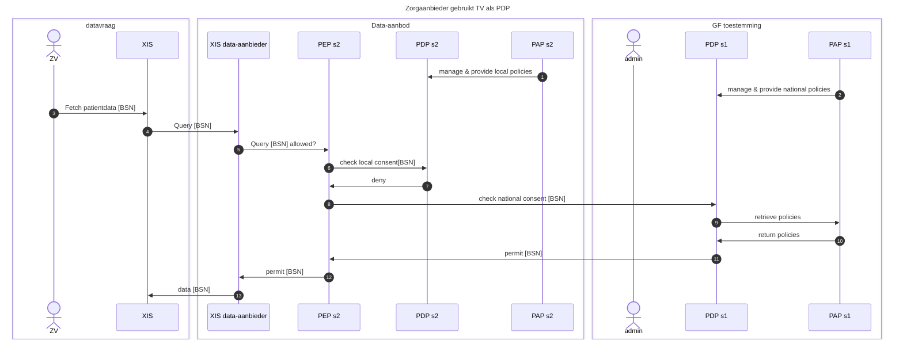
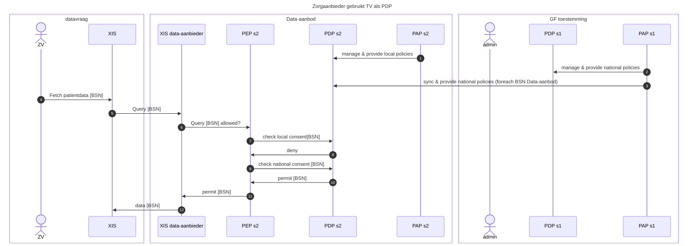

# Archimate tekening
## Archimate 3.2 raw file
(Generieke Functie Toestemmingen.xml) apart in deze repo voor gebruik in Archimate3.2 ondersteunende tools zoals Archi

## Archimate 3.2 PNG

# Sequentiediagrammen
## Sequentiediagram 1: Zorgaanbieder gebruikt TV als PDP

## Sequentiediagram 2: Zorgaanbieder gebruikt PDP s2 <-> TV synced als PDP

