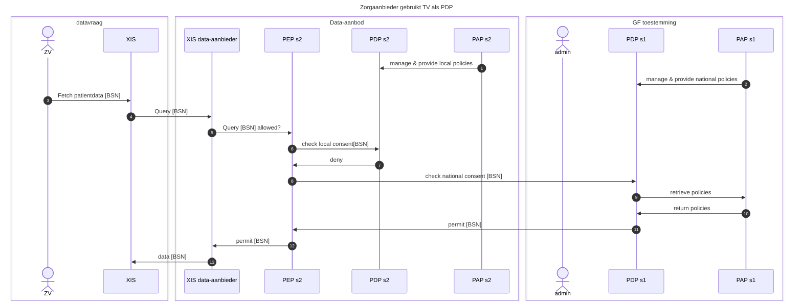

## Sequentiediagram 1: Zorgaanbieder gebruikt TV als PDP

## Sequentiediagram 2

# Archimate 3.2 SVG (raw file apart in repo)
# Sequentiediagrammen (MerMaid)
![Uploadin<?xml version="1.0" encoding="UTF-8"?>
<!DOCTYPE svg PUBLIC '-//W3C//DTD SVG 1.0//EN'
          'http://www.w3.org/TR/2001/REC-SVG-20010904/DTD/svg10.dtd'>
<svg fill-opacity="1" xmlns:xlink="http://www.w3.org/1999/xlink" color-rendering="auto" color-interpolation="auto" text-rendering="auto" stroke="black" stroke-linecap="square" stroke-miterlimit="10" shape-rendering="auto" stroke-opacity="1" fill="black" stroke-dasharray="none" font-weight="normal" stroke-width="1" viewBox="0 0 873 609" xmlns="http://www.w3.org/2000/svg" font-family="'Dialog'" font-style="normal" stroke-linejoin="miter" font-size="12px" stroke-dashoffset="0" image-rendering="auto"
><!--Generated by Archi with Batik SVG Generator--><defs id="genericDefs"
  /><g
  ><defs id="defs1"
    ><clipPath clipPathUnits="userSpaceOnUse" id="clipPath1"
      ><path d="M9 321 L348 321 L348 600 L9 600 L9 321 Z"
      /></clipPath
      ><clipPath clipPathUnits="userSpaceOnUse" id="clipPath2"
      ><path d="M13 323 L68 323 L68 340 L13 340 L13 323 Z"
      /></clipPath
      ><clipPath clipPathUnits="userSpaceOnUse" id="clipPath3"
      ><path d="M189 441 L311 441 L311 498 L189 498 L189 441 Z"
      /></clipPath
      ><clipPath clipPathUnits="userSpaceOnUse" id="clipPath4"
      ><path d="M241 445 L259 445 L259 462 L241 462 L241 445 Z"
      /></clipPath
      ><clipPath clipPathUnits="userSpaceOnUse" id="clipPath5"
      ><path d="M33 441 L155 441 L155 498 L33 498 L33 441 Z"
      /></clipPath
      ><clipPath clipPathUnits="userSpaceOnUse" id="clipPath6"
      ><path d="M59 445 L128 445 L128 477 L59 477 L59 445 Z"
      /></clipPath
      ><clipPath clipPathUnits="userSpaceOnUse" id="clipPath7"
      ><path d="M393 321 L864 321 L864 600 L393 600 L393 321 Z"
      /></clipPath
      ><clipPath clipPathUnits="userSpaceOnUse" id="clipPath8"
      ><path d="M397 323 L468 323 L468 340 L397 340 L397 323 Z"
      /></clipPath
      ><clipPath clipPathUnits="userSpaceOnUse" id="clipPath9"
      ><path d="M561 447 L683 447 L683 504 L561 504 L561 447 Z"
      /></clipPath
      ><clipPath clipPathUnits="userSpaceOnUse" id="clipPath10"
      ><path d="M595 451 L649 451 L649 483 L595 483 L595 451 Z"
      /></clipPath
      ><clipPath clipPathUnits="userSpaceOnUse" id="clipPath11"
      ><path d="M561 345 L683 345 L683 402 L561 402 L561 345 Z"
      /></clipPath
      ><clipPath clipPathUnits="userSpaceOnUse" id="clipPath12"
      ><path d="M604 349 L640 349 L640 366 L604 366 L604 349 Z"
      /></clipPath
      ><clipPath clipPathUnits="userSpaceOnUse" id="clipPath13"
      ><path d="M729 429 L851 429 L851 486 L729 486 L729 429 Z"
      /></clipPath
      ><clipPath clipPathUnits="userSpaceOnUse" id="clipPath14"
      ><path d="M771 433 L809 433 L809 450 L771 450 L771 433 Z"
      /></clipPath
      ><clipPath clipPathUnits="userSpaceOnUse" id="clipPath15"
      ><path d="M729 501 L851 501 L851 558 L729 558 L729 501 Z"
      /></clipPath
      ><clipPath clipPathUnits="userSpaceOnUse" id="clipPath16"
      ><path d="M771 505 L808 505 L808 522 L771 522 L771 505 Z"
      /></clipPath
      ><clipPath clipPathUnits="userSpaceOnUse" id="clipPath17"
      ><path d="M393 9 L864 9 L864 276 L393 276 L393 9 Z"
      /></clipPath
      ><clipPath clipPathUnits="userSpaceOnUse" id="clipPath18"
      ><path d="M397 11 L500 11 L500 28 L397 28 L397 11 Z"
      /></clipPath
      ><clipPath clipPathUnits="userSpaceOnUse" id="clipPath19"
      ><path d="M561 105 L683 105 L683 162 L561 162 L561 105 Z"
      /></clipPath
      ><clipPath clipPathUnits="userSpaceOnUse" id="clipPath20"
      ><path d="M582 109 L661 109 L661 156 L582 156 L582 109 Z"
      /></clipPath
      ><clipPath clipPathUnits="userSpaceOnUse" id="clipPath21"
      ><path d="M561 201 L683 201 L683 258 L561 258 L561 201 Z"
      /></clipPath
      ><clipPath clipPathUnits="userSpaceOnUse" id="clipPath22"
      ><path d="M603 205 L641 205 L641 222 L603 222 L603 205 Z"
      /></clipPath
      ><clipPath clipPathUnits="userSpaceOnUse" id="clipPath23"
      ><path d="M705 105 L827 105 L827 162 L705 162 L705 105 Z"
      /></clipPath
      ><clipPath clipPathUnits="userSpaceOnUse" id="clipPath24"
      ><path d="M747 109 L784 109 L784 126 L747 126 L747 109 Z"
      /></clipPath
      ><clipPath clipPathUnits="userSpaceOnUse" id="clipPath25"
      ><path d="M561 21 L695 21 L695 78 L561 78 L561 21 Z"
      /></clipPath
      ><clipPath clipPathUnits="userSpaceOnUse" id="clipPath26"
      ><path d="M584 25 L671 25 L671 42 L584 42 L584 25 Z"
      /></clipPath
      ><clipPath clipPathUnits="userSpaceOnUse" id="clipPath27"
      ><path d="M298 461 L574 461 L574 484 L298 484 L298 461 Z"
      /></clipPath
      ><clipPath clipPathUnits="userSpaceOnUse" id="clipPath28"
      ><path d="M142 458 L202 458 L202 481 L142 481 L142 458 Z"
      /></clipPath
      ><clipPath clipPathUnits="userSpaceOnUse" id="clipPath29"
      ><path d="M604 389 L641 389 L641 461 L604 461 L604 389 Z"
      /></clipPath
      ><clipPath clipPathUnits="userSpaceOnUse" id="clipPath30"
      ><path d="M614 426 L631 426 L631 451 L614 451 L614 426 Z"
      /></clipPath
      ><clipPath clipPathUnits="userSpaceOnUse" id="clipPath31"
      ><path d="M669 448 L742 448 L742 485 L669 485 L669 448 Z"
      /></clipPath
      ><clipPath clipPathUnits="userSpaceOnUse" id="clipPath32"
      ><path d="M679 458 L704 458 L704 475 L679 475 L679 458 Z"
      /></clipPath
      ><clipPath clipPathUnits="userSpaceOnUse" id="clipPath33"
      ><path d="M669 484 L742 484 L742 521 L669 521 L669 484 Z"
      /></clipPath
      ><clipPath clipPathUnits="userSpaceOnUse" id="clipPath34"
      ><path d="M679 494 L704 494 L704 511 L679 511 L679 494 Z"
      /></clipPath
      ><clipPath clipPathUnits="userSpaceOnUse" id="clipPath35"
      ><path d="M611 245 L634 245 L634 358 L611 358 L611 245 Z"
      /></clipPath
      ><clipPath clipPathUnits="userSpaceOnUse" id="clipPath36"
      ><path d="M669 116 L718 116 L718 153 L669 153 L669 116 Z"
      /></clipPath
      ><clipPath clipPathUnits="userSpaceOnUse" id="clipPath37"
      ><path d="M679 126 L704 126 L704 143 L679 143 L679 126 Z"
      /></clipPath
      ><clipPath clipPathUnits="userSpaceOnUse" id="clipPath38"
      ><path d="M604 148 L641 148 L641 214 L604 214 L604 148 Z"
      /></clipPath
      ><clipPath clipPathUnits="userSpaceOnUse" id="clipPath39"
      ><path d="M614 158 L631 158 L631 183 L614 183 L614 158 Z"
      /></clipPath
      ><clipPath clipPathUnits="userSpaceOnUse" id="clipPath40"
      ><path d="M603 64 L642 64 L642 118 L603 118 L603 64 Z"
      /></clipPath
      ><clipPath clipPathUnits="userSpaceOnUse" id="clipPath41"
      ><path d="M613 74 L632 74 L632 89 L613 89 L613 74 Z"
      /></clipPath
    ></defs
    ><g fill="white" text-rendering="optimizeLegibility" font-family="'Segoe UI'" stroke-linejoin="round" stroke="white" stroke-width="0" stroke-miterlimit="0"
    ><path d="M10 322 L346 322 L346 598 L10 598 L10 322" fill-rule="evenodd" clip-path="url(#clipPath1)" stroke="none"
    /></g
    ><g fill="rgb(178,178,178)" text-rendering="optimizeLegibility" stroke-dasharray="8,4" font-family="'Segoe UI'" stroke-linecap="butt" stroke="rgb(178,178,178)"
    ><polygon fill="none" points=" 10 322 346 322 346 598 10 598" clip-path="url(#clipPath1)"
      /><rect x="329" y="328" clip-path="url(#clipPath1)" fill="none" width="6" stroke-dasharray="none" height="3" stroke="black"
      /><rect x="329" y="331" clip-path="url(#clipPath1)" fill="none" width="13" stroke-dasharray="none" height="7" stroke="black"
      /><path fill="black" stroke-dasharray="none" d="M15.1094 337 L15.1094 328.5938 L17.4219 328.5938 Q21.8594 328.5938 21.8594 332.6875 Q21.8594 334.6406 20.625 335.8281 Q19.3906 337 17.3281 337 L15.1094 337 ZM16.0938 329.4844 L16.0938 336.1094 L17.3438 336.1094 Q19 336.1094 19.9062 335.2344 Q20.8281 334.3438 20.8281 332.7188 Q20.8281 329.4844 17.4062 329.4844 L16.0938 329.4844 ZM27.6797 337 L26.7266 337 L26.7266 336.0625 L26.6953 336.0625 Q26.0703 337.1406 24.8516 337.1406 Q23.9609 337.1406 23.4453 336.6719 Q22.9453 336.1875 22.9453 335.4062 Q22.9453 333.7188 24.9297 333.4531 L26.7266 333.2031 Q26.7266 331.6719 25.4922 331.6719 Q24.3984 331.6719 23.5234 332.4062 L23.5234 331.4219 Q24.4141 330.8594 25.5703 330.8594 Q27.6797 330.8594 27.6797 333.0938 L27.6797 337 ZM26.7266 333.9688 L25.2734 334.1562 Q24.6016 334.25 24.2578 334.5 Q23.9297 334.7344 23.9297 335.3281 Q23.9297 335.7812 24.2422 336.0625 Q24.5547 336.3281 25.0703 336.3281 Q25.7891 336.3281 26.2578 335.8281 Q26.7266 335.3281 26.7266 334.5625 L26.7266 333.9688 ZM32.2695 336.9375 Q31.9414 337.125 31.3789 337.125 Q29.8008 337.125 29.8008 335.375 L29.8008 331.8125 L28.7695 331.8125 L28.7695 331 L29.8008 331 L29.8008 329.5312 L30.7695 329.2188 L30.7695 331 L32.2695 331 L32.2695 331.8125 L30.7695 331.8125 L30.7695 335.2031 Q30.7695 335.7969 30.9727 336.0625 Q31.1758 336.3125 31.6445 336.3125 Q32.0195 336.3125 32.2695 336.125 L32.2695 336.9375 ZM37.8516 337 L36.8984 337 L36.8984 336.0625 L36.8672 336.0625 Q36.2422 337.1406 35.0234 337.1406 Q34.1328 337.1406 33.6172 336.6719 Q33.1172 336.1875 33.1172 335.4062 Q33.1172 333.7188 35.1016 333.4531 L36.8984 333.2031 Q36.8984 331.6719 35.6641 331.6719 Q34.5703 331.6719 33.6953 332.4062 L33.6953 331.4219 Q34.5859 330.8594 35.7422 330.8594 Q37.8516 330.8594 37.8516 333.0938 L37.8516 337 ZM36.8984 333.9688 L35.4453 334.1562 Q34.7734 334.25 34.4297 334.5 Q34.1016 334.7344 34.1016 335.3281 Q34.1016 335.7812 34.4141 336.0625 Q34.7266 336.3281 35.2422 336.3281 Q35.9609 336.3281 36.4297 335.8281 Q36.8984 335.3281 36.8984 334.5625 L36.8984 333.9688 ZM44.3789 331 L41.9883 337 L41.0508 337 L38.7695 331 L39.832 331 L41.3477 335.3594 Q41.5195 335.8438 41.5664 336.2031 L41.582 336.2031 Q41.6445 335.75 41.7695 335.375 L43.3633 331 L44.3789 331 ZM48.5488 331.9688 Q48.2832 331.7812 47.8145 331.7812 Q47.2051 331.7812 46.7832 332.3594 Q46.377 332.9375 46.377 333.9375 L46.377 337 L45.4082 337 L45.4082 331 L46.377 331 L46.377 332.2344 L46.3926 332.2344 Q46.5957 331.6094 47.0176 331.25 Q47.4395 330.8906 47.9707 330.8906 Q48.3457 330.8906 48.5488 330.9688 L48.5488 331.9688 ZM53.877 337 L52.9238 337 L52.9238 336.0625 L52.8926 336.0625 Q52.2676 337.1406 51.0488 337.1406 Q50.1582 337.1406 49.6426 336.6719 Q49.1426 336.1875 49.1426 335.4062 Q49.1426 333.7188 51.127 333.4531 L52.9238 333.2031 Q52.9238 331.6719 51.6895 331.6719 Q50.5957 331.6719 49.7207 332.4062 L49.7207 331.4219 Q50.6113 330.8594 51.7676 330.8594 Q53.877 330.8594 53.877 333.0938 L53.877 337 ZM52.9238 333.9688 L51.4707 334.1562 Q50.7988 334.25 50.4551 334.5 Q50.127 334.7344 50.127 335.3281 Q50.127 335.7812 50.4395 336.0625 Q50.752 336.3281 51.2676 336.3281 Q51.9863 336.3281 52.4551 335.8281 Q52.9238 335.3281 52.9238 334.5625 L52.9238 333.9688 ZM59.9824 337 L59.0293 337 L59.0293 336.0625 L58.998 336.0625 Q58.373 337.1406 57.1543 337.1406 Q56.2637 337.1406 55.748 336.6719 Q55.248 336.1875 55.248 335.4062 Q55.248 333.7188 57.2324 333.4531 L59.0293 333.2031 Q59.0293 331.6719 57.7949 331.6719 Q56.7012 331.6719 55.8262 332.4062 L55.8262 331.4219 Q56.7168 330.8594 57.873 330.8594 Q59.9824 330.8594 59.9824 333.0938 L59.9824 337 ZM59.0293 333.9688 L57.5762 334.1562 Q56.9043 334.25 56.5605 334.5 Q56.2324 334.7344 56.2324 335.3281 Q56.2324 335.7812 56.5449 336.0625 Q56.8574 336.3281 57.373 336.3281 Q58.0918 336.3281 58.5605 335.8281 Q59.0293 335.3281 59.0293 334.5625 L59.0293 333.9688 ZM66.916 336.5156 Q66.916 339.8281 63.7598 339.8281 Q62.6348 339.8281 61.8066 339.4062 L61.8066 338.4375 Q62.8223 339 63.7441 339 Q65.9629 339 65.9629 336.6406 L65.9629 335.9844 L65.9316 335.9844 Q65.2441 337.1406 63.8691 337.1406 Q62.7441 337.1406 62.0566 336.3438 Q61.3848 335.5469 61.3848 334.1875 Q61.3848 332.6562 62.1191 331.7656 Q62.8535 330.8594 64.1348 330.8594 Q65.3535 330.8594 65.9316 331.8281 L65.9629 331.8281 L65.9629 331 L66.916 331 L66.916 336.5156 ZM65.9629 334.2812 L65.9629 333.4062 Q65.9629 332.6875 65.4785 332.1875 Q64.9941 331.6719 64.2754 331.6719 Q63.3848 331.6719 62.8691 332.3281 Q62.3691 332.9688 62.3691 334.125 Q62.3691 335.125 62.8535 335.7344 Q63.3379 336.3281 64.1348 336.3281 Q64.9473 336.3281 65.4473 335.7656 Q65.9629 335.1875 65.9629 334.2812 Z" clip-path="url(#clipPath2)" stroke="none"
      /><rect x="190" y="442" clip-path="url(#clipPath3)" fill="rgb(181,255,255)" width="119" stroke-dasharray="none" height="54" stroke="none"
      /><rect x="190" y="442" clip-path="url(#clipPath3)" fill="none" width="119" stroke-dasharray="none" height="54" stroke="rgb(126,178,178)"
      /><path fill="none" stroke-dasharray="none" d="M295 461 L295 457 M295 455 L295 453 M295 450 L295 448 L305 448 L305 461 L294.5 461 M292 450 L298 450 L298 452.5 L292 452.5 ZM292 455 L298 455 L298 457.5 L292 457.5 Z" clip-path="url(#clipPath3)" fill-rule="evenodd" stroke="black"
      /><path fill="black" stroke-dasharray="none" d="M248.9062 459 L247.7031 459 L245.7656 455.7812 Q245.6875 455.6406 245.5781 455.3594 L245.5469 455.3594 Q245.5 455.5 245.3594 455.7812 L243.3594 459 L242.1562 459 L244.9688 454.7812 L242.375 450.5938 L243.5781 450.5938 L245.2969 453.5469 Q245.4688 453.8438 245.5938 454.1406 L245.625 454.1406 Q245.8125 453.75 245.9531 453.5312 L247.7344 450.5938 L248.875 450.5938 L246.2188 454.7656 L248.9062 459 ZM251.1719 459 L250.1875 459 L250.1875 450.5938 L251.1719 450.5938 L251.1719 459 ZM252.9746 458.6562 L252.9746 457.5 Q253.1777 457.6719 253.459 457.8125 Q253.7402 457.9531 254.0371 458.0625 Q254.3496 458.1562 254.6621 458.2031 Q254.9746 458.25 255.2402 458.25 Q256.1465 458.25 256.584 457.9219 Q257.0371 457.5781 257.0371 456.9531 Q257.0371 456.6094 256.8809 456.3594 Q256.7402 456.1094 256.4746 455.9062 Q256.209 455.6875 255.8496 455.5 Q255.4902 455.3125 255.084 455.0938 Q254.6465 454.875 254.2559 454.6562 Q253.8809 454.4219 253.5996 454.1406 Q253.3184 453.8594 253.1465 453.5156 Q252.9902 453.1719 252.9902 452.7031 Q252.9902 452.125 253.2402 451.7031 Q253.4902 451.2812 253.8965 451 Q254.3184 450.7188 254.834 450.5938 Q255.3652 450.4531 255.9121 450.4531 Q257.1465 450.4531 257.7246 450.75 L257.7246 451.8594 Q256.9746 451.3438 255.8184 451.3438 Q255.4902 451.3438 255.1621 451.4219 Q254.8496 451.4844 254.584 451.6406 Q254.334 451.7812 254.1777 452.0312 Q254.0215 452.2656 254.0215 452.6094 Q254.0215 452.9375 254.1465 453.1719 Q254.2715 453.4062 254.5059 453.6094 Q254.7402 453.7969 255.0684 453.9844 Q255.4121 454.1562 255.8496 454.375 Q256.3027 454.5938 256.6934 454.8438 Q257.0996 455.0781 257.3965 455.3906 Q257.709 455.6875 257.8809 456.0469 Q258.0684 456.4062 258.0684 456.875 Q258.0684 457.5 257.8184 457.9375 Q257.584 458.3594 257.1621 458.6406 Q256.7559 458.9062 256.209 459.0156 Q255.6777 459.1406 255.084 459.1406 Q254.8809 459.1406 254.584 459.1094 Q254.3027 459.0781 253.9902 459.0156 Q253.6934 458.9531 253.4121 458.8594 Q253.1465 458.7656 252.9746 458.6562 Z" clip-path="url(#clipPath4)" stroke="none"
      /><rect x="34" y="442" clip-path="url(#clipPath5)" fill="rgb(255,255,181)" width="119" stroke-dasharray="none" height="54" stroke="none"
      /><rect x="34" y="442" clip-path="url(#clipPath5)" fill="none" width="119" stroke-dasharray="none" height="54" stroke="rgb(178,178,126)"
      /><circle clip-path="url(#clipPath5)" fill="none" r="3" stroke-dasharray="none" cx="146" cy="449" stroke="black"
      /><line clip-path="url(#clipPath5)" fill="none" x1="146" x2="146" y1="452" y2="458" stroke-dasharray="none" stroke="black"
      /><line clip-path="url(#clipPath5)" fill="none" x1="146" x2="142" y1="458" y2="463" stroke-dasharray="none" stroke="black"
      /><line clip-path="url(#clipPath5)" fill="none" x1="146" x2="150" y1="458" y2="463" stroke-dasharray="none" stroke="black"
      /><line clip-path="url(#clipPath5)" fill="none" x1="142" x2="150" y1="455" y2="455" stroke-dasharray="none" stroke="black"
      /><path fill="black" stroke-dasharray="none" d="M66.5938 450.8281 L61.6719 458.1094 L66.4688 458.1094 L66.4688 459 L60.1875 459 L60.1875 458.7188 L65.0781 451.4844 L60.5938 451.4844 L60.5938 450.5938 L66.5938 450.5938 L66.5938 450.8281 ZM70.3281 459.1406 Q69 459.1406 68.2031 458.2969 Q67.4062 457.4531 67.4062 456.0625 Q67.4062 454.5625 68.2344 453.7188 Q69.0625 452.8594 70.4688 452.8594 Q71.8125 452.8594 72.5625 453.6875 Q73.3125 454.5156 73.3125 455.9688 Q73.3125 457.4062 72.5 458.2812 Q71.6875 459.1406 70.3281 459.1406 ZM70.3906 453.6719 Q69.4688 453.6719 68.9219 454.2969 Q68.3906 454.9219 68.3906 456.0312 Q68.3906 457.0938 68.9375 457.7188 Q69.4844 458.3281 70.3906 458.3281 Q71.3281 458.3281 71.8281 457.7344 Q72.3281 457.125 72.3281 456.0156 Q72.3281 454.8906 71.8281 454.2812 Q71.3281 453.6719 70.3906 453.6719 ZM77.9844 453.9688 Q77.7188 453.7812 77.25 453.7812 Q76.6406 453.7812 76.2188 454.3594 Q75.8125 454.9375 75.8125 455.9375 L75.8125 459 L74.8438 459 L74.8438 453 L75.8125 453 L75.8125 454.2344 L75.8281 454.2344 Q76.0312 453.6094 76.4531 453.25 Q76.875 452.8906 77.4062 452.8906 Q77.7812 452.8906 77.9844 452.9688 L77.9844 453.9688 ZM84.1406 458.5156 Q84.1406 461.8281 80.9844 461.8281 Q79.8594 461.8281 79.0312 461.4062 L79.0312 460.4375 Q80.0469 461 80.9688 461 Q83.1875 461 83.1875 458.6406 L83.1875 457.9844 L83.1562 457.9844 Q82.4688 459.1406 81.0938 459.1406 Q79.9688 459.1406 79.2812 458.3438 Q78.6094 457.5469 78.6094 456.1875 Q78.6094 454.6562 79.3438 453.7656 Q80.0781 452.8594 81.3594 452.8594 Q82.5781 452.8594 83.1562 453.8281 L83.1875 453.8281 L83.1875 453 L84.1406 453 L84.1406 458.5156 ZM83.1875 456.2812 L83.1875 455.4062 Q83.1875 454.6875 82.7031 454.1875 Q82.2188 453.6719 81.5 453.6719 Q80.6094 453.6719 80.0938 454.3281 Q79.5938 454.9688 79.5938 456.125 Q79.5938 457.125 80.0781 457.7344 Q80.5625 458.3281 81.3594 458.3281 Q82.1719 458.3281 82.6719 457.7656 Q83.1875 457.1875 83.1875 456.2812 ZM90.8008 453 L88.4102 459 L87.4727 459 L85.1914 453 L86.2539 453 L87.7695 457.3594 Q87.9414 457.8438 87.9883 458.2031 L88.0039 458.2031 Q88.0664 457.75 88.1914 457.375 L89.7852 453 L90.8008 453 ZM96.6582 456.2344 L92.4238 456.2344 Q92.4395 457.2344 92.9551 457.7812 Q93.4707 458.3281 94.377 458.3281 Q95.3926 458.3281 96.2363 457.6562 L96.2363 458.5625 Q95.4551 459.1406 94.1426 459.1406 Q92.877 459.1406 92.1426 458.3281 Q91.4238 457.5 91.4238 456.0156 Q91.4238 454.625 92.2207 453.75 Q93.0176 452.8594 94.1895 452.8594 Q95.3613 452.8594 96.002 453.625 Q96.6582 454.375 96.6582 455.7344 L96.6582 456.2344 ZM95.6738 455.4219 Q95.6738 454.5938 95.2676 454.1406 Q94.877 453.6719 94.1738 453.6719 Q93.4863 453.6719 93.0176 454.1562 Q92.5488 454.6406 92.4395 455.4219 L95.6738 455.4219 ZM101.2461 453.9688 Q100.9805 453.7812 100.5117 453.7812 Q99.9023 453.7812 99.4805 454.3594 Q99.0742 454.9375 99.0742 455.9375 L99.0742 459 L98.1055 459 L98.1055 453 L99.0742 453 L99.0742 454.2344 L99.0898 454.2344 Q99.293 453.6094 99.7148 453.25 Q100.1367 452.8906 100.668 452.8906 Q101.043 452.8906 101.2461 452.9688 L101.2461 453.9688 ZM103.2461 459 L102.2773 459 L102.2773 450.1094 L103.2461 450.1094 L103.2461 459 ZM110.0117 456.2344 L105.7773 456.2344 Q105.793 457.2344 106.3086 457.7812 Q106.8242 458.3281 107.7305 458.3281 Q108.7461 458.3281 109.5898 457.6562 L109.5898 458.5625 Q108.8086 459.1406 107.4961 459.1406 Q106.2305 459.1406 105.4961 458.3281 Q104.7773 457.5 104.7773 456.0156 Q104.7773 454.625 105.5742 453.75 Q106.3711 452.8594 107.543 452.8594 Q108.7148 452.8594 109.3555 453.625 Q110.0117 454.375 110.0117 455.7344 L110.0117 456.2344 ZM109.0273 455.4219 Q109.0273 454.5938 108.6211 454.1406 Q108.2305 453.6719 107.5273 453.6719 Q106.8398 453.6719 106.3711 454.1562 Q105.9023 454.6406 105.793 455.4219 L109.0273 455.4219 ZM116.4434 459 L115.4902 459 L115.4902 455.5781 Q115.4902 453.6719 114.084 453.6719 Q113.3652 453.6719 112.8965 454.2188 Q112.4277 454.75 112.4277 455.5781 L112.4277 459 L111.459 459 L111.459 453 L112.4277 453 L112.4277 454 L112.4434 454 Q113.1309 452.8594 114.4121 452.8594 Q115.3965 452.8594 115.9121 453.5 Q116.4434 454.125 116.4434 455.3281 L116.4434 459 ZM123.0781 456.2344 L118.8438 456.2344 Q118.8594 457.2344 119.375 457.7812 Q119.8906 458.3281 120.7969 458.3281 Q121.8125 458.3281 122.6562 457.6562 L122.6562 458.5625 Q121.875 459.1406 120.5625 459.1406 Q119.2969 459.1406 118.5625 458.3281 Q117.8438 457.5 117.8438 456.0156 Q117.8438 454.625 118.6406 453.75 Q119.4375 452.8594 120.6094 452.8594 Q121.7812 452.8594 122.4219 453.625 Q123.0781 454.375 123.0781 455.7344 L123.0781 456.2344 ZM122.0938 455.4219 Q122.0938 454.5938 121.6875 454.1406 Q121.2969 453.6719 120.5938 453.6719 Q119.9062 453.6719 119.4375 454.1562 Q118.9688 454.6406 118.8594 455.4219 L122.0938 455.4219 ZM127.666 453.9688 Q127.4004 453.7812 126.9316 453.7812 Q126.3223 453.7812 125.9004 454.3594 Q125.4941 454.9375 125.4941 455.9375 L125.4941 459 L124.5254 459 L124.5254 453 L125.4941 453 L125.4941 454.2344 L125.5098 454.2344 Q125.7129 453.6094 126.1348 453.25 Q126.5566 452.8906 127.0879 452.8906 Q127.4629 452.8906 127.666 452.9688 L127.666 453.9688 Z" clip-path="url(#clipPath6)" stroke="none"
      /><path fill="black" stroke-dasharray="none" d="M86.5 475.9062 L85.6406 475.9062 Q83.8281 473.8281 83.8281 470.7969 Q83.8281 467.7344 85.6406 465.5938 L86.5 465.5938 Q84.6719 467.8281 84.6719 470.7812 Q84.6719 473.7188 86.5 475.9062 ZM93.2148 465.8281 L88.293 473.1094 L93.0898 473.1094 L93.0898 474 L86.8086 474 L86.8086 473.7188 L91.6992 466.4844 L87.2148 466.4844 L87.2148 465.5938 L93.2148 465.5938 L93.2148 465.8281 ZM100.8086 465.5938 L97.6992 474 L96.6211 474 L93.5742 465.5938 L94.668 465.5938 L96.9961 472.2656 Q97.1055 472.5781 97.168 473 L97.1836 473 Q97.2305 472.6562 97.3867 472.25 L99.7461 465.5938 L100.8086 465.5938 ZM101.918 475.9062 L101.0586 475.9062 Q102.8867 473.7188 102.8867 470.7812 Q102.8867 467.8281 101.043 465.5938 L101.918 465.5938 Q103.7461 467.7344 103.7461 470.7969 Q103.7461 473.8281 101.918 475.9062 Z" clip-path="url(#clipPath6)" stroke="none"
      /><path fill="white" stroke-dasharray="none" d="M394 322 L862 322 L862 598 L394 598 L394 322" clip-path="url(#clipPath7)" fill-rule="evenodd" stroke="none"
      /><polygon fill="none" points=" 394 322 862 322 862 598 394 598" clip-path="url(#clipPath7)"
      /><rect x="845" y="328" clip-path="url(#clipPath7)" fill="none" width="6" stroke-dasharray="none" height="3" stroke="black"
      /><rect x="845" y="331" clip-path="url(#clipPath7)" fill="none" width="13" stroke-dasharray="none" height="7" stroke="black"
      /><path fill="black" stroke-dasharray="none" d="M399.1094 337 L399.1094 328.5938 L401.4219 328.5938 Q405.8594 328.5938 405.8594 332.6875 Q405.8594 334.6406 404.625 335.8281 Q403.3906 337 401.3281 337 L399.1094 337 ZM400.0938 329.4844 L400.0938 336.1094 L401.3438 336.1094 Q403 336.1094 403.9062 335.2344 Q404.8281 334.3438 404.8281 332.7188 Q404.8281 329.4844 401.4062 329.4844 L400.0938 329.4844 ZM411.6797 337 L410.7266 337 L410.7266 336.0625 L410.6953 336.0625 Q410.0703 337.1406 408.8516 337.1406 Q407.9609 337.1406 407.4453 336.6719 Q406.9453 336.1875 406.9453 335.4062 Q406.9453 333.7188 408.9297 333.4531 L410.7266 333.2031 Q410.7266 331.6719 409.4922 331.6719 Q408.3984 331.6719 407.5234 332.4062 L407.5234 331.4219 Q408.4141 330.8594 409.5703 330.8594 Q411.6797 330.8594 411.6797 333.0938 L411.6797 337 ZM410.7266 333.9688 L409.2734 334.1562 Q408.6016 334.25 408.2578 334.5 Q407.9297 334.7344 407.9297 335.3281 Q407.9297 335.7812 408.2422 336.0625 Q408.5547 336.3281 409.0703 336.3281 Q409.7891 336.3281 410.2578 335.8281 Q410.7266 335.3281 410.7266 334.5625 L410.7266 333.9688 ZM416.2695 336.9375 Q415.9414 337.125 415.3789 337.125 Q413.8008 337.125 413.8008 335.375 L413.8008 331.8125 L412.7695 331.8125 L412.7695 331 L413.8008 331 L413.8008 329.5312 L414.7695 329.2188 L414.7695 331 L416.2695 331 L416.2695 331.8125 L414.7695 331.8125 L414.7695 335.2031 Q414.7695 335.7969 414.9727 336.0625 Q415.1758 336.3125 415.6445 336.3125 Q416.0195 336.3125 416.2695 336.125 L416.2695 336.9375 ZM421.8516 337 L420.8984 337 L420.8984 336.0625 L420.8672 336.0625 Q420.2422 337.1406 419.0234 337.1406 Q418.1328 337.1406 417.6172 336.6719 Q417.1172 336.1875 417.1172 335.4062 Q417.1172 333.7188 419.1016 333.4531 L420.8984 333.2031 Q420.8984 331.6719 419.6641 331.6719 Q418.5703 331.6719 417.6953 332.4062 L417.6953 331.4219 Q418.5859 330.8594 419.7422 330.8594 Q421.8516 330.8594 421.8516 333.0938 L421.8516 337 ZM420.8984 333.9688 L419.4453 334.1562 Q418.7734 334.25 418.4297 334.5 Q418.1016 334.7344 418.1016 335.3281 Q418.1016 335.7812 418.4141 336.0625 Q418.7266 336.3281 419.2422 336.3281 Q419.9609 336.3281 420.4297 335.8281 Q420.8984 335.3281 420.8984 334.5625 L420.8984 333.9688 ZM426.7383 334.0312 L423.5352 334.0312 L423.5352 333.2812 L426.7383 333.2812 L426.7383 334.0312 ZM432.7559 337 L431.8027 337 L431.8027 336.0625 L431.7715 336.0625 Q431.1465 337.1406 429.9277 337.1406 Q429.0371 337.1406 428.5215 336.6719 Q428.0215 336.1875 428.0215 335.4062 Q428.0215 333.7188 430.0059 333.4531 L431.8027 333.2031 Q431.8027 331.6719 430.5684 331.6719 Q429.4746 331.6719 428.5996 332.4062 L428.5996 331.4219 Q429.4902 330.8594 430.6465 330.8594 Q432.7559 330.8594 432.7559 333.0938 L432.7559 337 ZM431.8027 333.9688 L430.3496 334.1562 Q429.6777 334.25 429.334 334.5 Q429.0059 334.7344 429.0059 335.3281 Q429.0059 335.7812 429.3184 336.0625 Q429.6309 336.3281 430.1465 336.3281 Q430.8652 336.3281 431.334 335.8281 Q431.8027 335.3281 431.8027 334.5625 L431.8027 333.9688 ZM438.8613 337 L437.9082 337 L437.9082 336.0625 L437.877 336.0625 Q437.252 337.1406 436.0332 337.1406 Q435.1426 337.1406 434.627 336.6719 Q434.127 336.1875 434.127 335.4062 Q434.127 333.7188 436.1113 333.4531 L437.9082 333.2031 Q437.9082 331.6719 436.6738 331.6719 Q435.5801 331.6719 434.7051 332.4062 L434.7051 331.4219 Q435.5957 330.8594 436.752 330.8594 Q438.8613 330.8594 438.8613 333.0938 L438.8613 337 ZM437.9082 333.9688 L436.4551 334.1562 Q435.7832 334.25 435.4395 334.5 Q435.1113 334.7344 435.1113 335.3281 Q435.1113 335.7812 435.4238 336.0625 Q435.7363 336.3281 436.252 336.3281 Q436.9707 336.3281 437.4395 335.8281 Q437.9082 335.3281 437.9082 334.5625 L437.9082 333.9688 ZM445.6543 337 L444.7012 337 L444.7012 333.5781 Q444.7012 331.6719 443.2949 331.6719 Q442.5762 331.6719 442.1074 332.2188 Q441.6387 332.75 441.6387 333.5781 L441.6387 337 L440.6699 337 L440.6699 331 L441.6387 331 L441.6387 332 L441.6543 332 Q442.3418 330.8594 443.623 330.8594 Q444.6074 330.8594 445.123 331.5 Q445.6543 332.125 445.6543 333.3281 L445.6543 337 ZM448.4453 336.125 L448.4297 336.125 L448.4297 337 L447.4609 337 L447.4609 328.1094 L448.4297 328.1094 L448.4297 332.0469 L448.4453 332.0469 Q449.1641 330.8594 450.5234 330.8594 Q451.6797 330.8594 452.3359 331.6719 Q452.9922 332.4688 452.9922 333.8281 Q452.9922 335.3281 452.2578 336.2344 Q451.5234 337.1406 450.2422 337.1406 Q449.0547 337.1406 448.4453 336.125 ZM448.4297 333.7188 L448.4297 334.5469 Q448.4297 335.2969 448.9141 335.8125 Q449.3984 336.3281 450.1328 336.3281 Q451.0078 336.3281 451.5078 335.6719 Q452.0078 335 452.0078 333.8125 Q452.0078 332.7969 451.5391 332.2344 Q451.0703 331.6719 450.2891 331.6719 Q449.4453 331.6719 448.9297 332.25 Q448.4297 332.8281 448.4297 333.7188 ZM457.0312 337.1406 Q455.7031 337.1406 454.9062 336.2969 Q454.1094 335.4531 454.1094 334.0625 Q454.1094 332.5625 454.9375 331.7188 Q455.7656 330.8594 457.1719 330.8594 Q458.5156 330.8594 459.2656 331.6875 Q460.0156 332.5156 460.0156 333.9688 Q460.0156 335.4062 459.2031 336.2812 Q458.3906 337.1406 457.0312 337.1406 ZM457.0938 331.6719 Q456.1719 331.6719 455.625 332.2969 Q455.0938 332.9219 455.0938 334.0312 Q455.0938 335.0938 455.6406 335.7188 Q456.1875 336.3281 457.0938 336.3281 Q458.0312 336.3281 458.5312 335.7344 Q459.0312 335.125 459.0312 334.0156 Q459.0312 332.8906 458.5312 332.2812 Q458.0312 331.6719 457.0938 331.6719 ZM466.6719 337 L465.7188 337 L465.7188 335.9844 L465.6875 335.9844 Q465.0156 337.1406 463.625 337.1406 Q462.5 337.1406 461.8125 336.3438 Q461.1406 335.5312 461.1406 334.1406 Q461.1406 332.6562 461.8906 331.7656 Q462.6406 330.8594 463.8906 330.8594 Q465.125 330.8594 465.6875 331.8281 L465.7188 331.8281 L465.7188 328.1094 L466.6719 328.1094 L466.6719 337 ZM465.7188 334.2812 L465.7188 333.4062 Q465.7188 332.6719 465.2344 332.1719 Q464.75 331.6719 464.0156 331.6719 Q463.1406 331.6719 462.625 332.3125 Q462.125 332.9531 462.125 334.0938 Q462.125 335.125 462.6094 335.7344 Q463.0938 336.3281 463.9062 336.3281 Q464.7031 336.3281 465.2031 335.75 Q465.7188 335.1719 465.7188 334.2812 Z" clip-path="url(#clipPath8)" stroke="none"
      /><rect x="562" y="448" clip-path="url(#clipPath9)" fill="rgb(181,255,255)" width="119" stroke-dasharray="none" height="54" stroke="none"
      /><rect x="562" y="448" clip-path="url(#clipPath9)" fill="none" width="119" stroke-dasharray="none" height="54" stroke="rgb(126,178,178)"
      /><path fill="none" stroke-dasharray="none" d="M667 467 L667 463 M667 461 L667 459 M667 456 L667 454 L677 454 L677 467 L666.5 467 M664 456 L670 456 L670 458.5 L664 458.5 ZM664 461 L670 461 L670 463.5 L664 463.5 Z" clip-path="url(#clipPath9)" fill-rule="evenodd" stroke="black"
      /><path fill="black" stroke-dasharray="none" d="M604.9062 465 L603.7031 465 L601.7656 461.7812 Q601.6875 461.6406 601.5781 461.3594 L601.5469 461.3594 Q601.5 461.5 601.3594 461.7812 L599.3594 465 L598.1562 465 L600.9688 460.7812 L598.375 456.5938 L599.5781 456.5938 L601.2969 459.5469 Q601.4688 459.8438 601.5938 460.1406 L601.625 460.1406 Q601.8125 459.75 601.9531 459.5312 L603.7344 456.5938 L604.875 456.5938 L602.2188 460.7656 L604.9062 465 ZM607.1719 465 L606.1875 465 L606.1875 456.5938 L607.1719 456.5938 L607.1719 465 ZM608.9746 464.6562 L608.9746 463.5 Q609.1777 463.6719 609.459 463.8125 Q609.7402 463.9531 610.0371 464.0625 Q610.3496 464.1562 610.6621 464.2031 Q610.9746 464.25 611.2402 464.25 Q612.1465 464.25 612.584 463.9219 Q613.0371 463.5781 613.0371 462.9531 Q613.0371 462.6094 612.8809 462.3594 Q612.7402 462.1094 612.4746 461.9062 Q612.209 461.6875 611.8496 461.5 Q611.4902 461.3125 611.084 461.0938 Q610.6465 460.875 610.2559 460.6562 Q609.8809 460.4219 609.5996 460.1406 Q609.3184 459.8594 609.1465 459.5156 Q608.9902 459.1719 608.9902 458.7031 Q608.9902 458.125 609.2402 457.7031 Q609.4902 457.2812 609.8965 457 Q610.3184 456.7188 610.834 456.5938 Q611.3652 456.4531 611.9121 456.4531 Q613.1465 456.4531 613.7246 456.75 L613.7246 457.8594 Q612.9746 457.3438 611.8184 457.3438 Q611.4902 457.3438 611.1621 457.4219 Q610.8496 457.4844 610.584 457.6406 Q610.334 457.7812 610.1777 458.0312 Q610.0215 458.2656 610.0215 458.6094 Q610.0215 458.9375 610.1465 459.1719 Q610.2715 459.4062 610.5059 459.6094 Q610.7402 459.7969 611.0684 459.9844 Q611.4121 460.1562 611.8496 460.375 Q612.3027 460.5938 612.6934 460.8438 Q613.0996 461.0781 613.3965 461.3906 Q613.709 461.6875 613.8809 462.0469 Q614.0684 462.4062 614.0684 462.875 Q614.0684 463.5 613.8184 463.9375 Q613.584 464.3594 613.1621 464.6406 Q612.7559 464.9062 612.209 465.0156 Q611.6777 465.1406 611.084 465.1406 Q610.8809 465.1406 610.584 465.1094 Q610.3027 465.0781 609.9902 465.0156 Q609.6934 464.9531 609.4121 464.8594 Q609.1465 464.7656 608.9746 464.6562 ZM624.0273 465 L623.0742 465 L623.0742 463.9844 L623.043 463.9844 Q622.3711 465.1406 620.9805 465.1406 Q619.8555 465.1406 619.168 464.3438 Q618.4961 463.5312 618.4961 462.1406 Q618.4961 460.6562 619.2461 459.7656 Q619.9961 458.8594 621.2461 458.8594 Q622.4805 458.8594 623.043 459.8281 L623.0742 459.8281 L623.0742 456.1094 L624.0273 456.1094 L624.0273 465 ZM623.0742 462.2812 L623.0742 461.4062 Q623.0742 460.6719 622.5898 460.1719 Q622.1055 459.6719 621.3711 459.6719 Q620.4961 459.6719 619.9805 460.3125 Q619.4805 460.9531 619.4805 462.0938 Q619.4805 463.125 619.9648 463.7344 Q620.4492 464.3281 621.2617 464.3281 Q622.0586 464.3281 622.5586 463.75 Q623.0742 463.1719 623.0742 462.2812 ZM630.2656 465 L629.3125 465 L629.3125 464.0625 L629.2812 464.0625 Q628.6562 465.1406 627.4375 465.1406 Q626.5469 465.1406 626.0312 464.6719 Q625.5312 464.1875 625.5312 463.4062 Q625.5312 461.7188 627.5156 461.4531 L629.3125 461.2031 Q629.3125 459.6719 628.0781 459.6719 Q626.9844 459.6719 626.1094 460.4062 L626.1094 459.4219 Q627 458.8594 628.1562 458.8594 Q630.2656 458.8594 630.2656 461.0938 L630.2656 465 ZM629.3125 461.9688 L627.8594 462.1562 Q627.1875 462.25 626.8438 462.5 Q626.5156 462.7344 626.5156 463.3281 Q626.5156 463.7812 626.8281 464.0625 Q627.1406 464.3281 627.6562 464.3281 Q628.375 464.3281 628.8438 463.8281 Q629.3125 463.3281 629.3125 462.5625 L629.3125 461.9688 ZM634.8555 464.9375 Q634.5273 465.125 633.9648 465.125 Q632.3867 465.125 632.3867 463.375 L632.3867 459.8125 L631.3555 459.8125 L631.3555 459 L632.3867 459 L632.3867 457.5312 L633.3555 457.2188 L633.3555 459 L634.8555 459 L634.8555 459.8125 L633.3555 459.8125 L633.3555 463.2031 Q633.3555 463.7969 633.5586 464.0625 Q633.7617 464.3125 634.2305 464.3125 Q634.6055 464.3125 634.8555 464.125 L634.8555 464.9375 ZM640.4375 465 L639.4844 465 L639.4844 464.0625 L639.4531 464.0625 Q638.8281 465.1406 637.6094 465.1406 Q636.7188 465.1406 636.2031 464.6719 Q635.7031 464.1875 635.7031 463.4062 Q635.7031 461.7188 637.6875 461.4531 L639.4844 461.2031 Q639.4844 459.6719 638.25 459.6719 Q637.1562 459.6719 636.2812 460.4062 L636.2812 459.4219 Q637.1719 458.8594 638.3281 458.8594 Q640.4375 458.8594 640.4375 461.0938 L640.4375 465 ZM639.4844 461.9688 L638.0312 462.1562 Q637.3594 462.25 637.0156 462.5 Q636.6875 462.7344 636.6875 463.3281 Q636.6875 463.7812 637 464.0625 Q637.3125 464.3281 637.8281 464.3281 Q638.5469 464.3281 639.0156 463.8281 Q639.4844 463.3281 639.4844 462.5625 L639.4844 461.9688 ZM645.3242 462.0312 L642.1211 462.0312 L642.1211 461.2812 L645.3242 461.2812 L645.3242 462.0312 Z" clip-path="url(#clipPath10)" stroke="none"
      /><path fill="black" stroke-dasharray="none" d="M601.2656 480 L600.3125 480 L600.3125 479.0625 L600.2812 479.0625 Q599.6562 480.1406 598.4375 480.1406 Q597.5469 480.1406 597.0312 479.6719 Q596.5312 479.1875 596.5312 478.4062 Q596.5312 476.7188 598.5156 476.4531 L600.3125 476.2031 Q600.3125 474.6719 599.0781 474.6719 Q597.9844 474.6719 597.1094 475.4062 L597.1094 474.4219 Q598 473.8594 599.1562 473.8594 Q601.2656 473.8594 601.2656 476.0938 L601.2656 480 ZM600.3125 476.9688 L598.8594 477.1562 Q598.1875 477.25 597.8438 477.5 Q597.5156 477.7344 597.5156 478.3281 Q597.5156 478.7812 597.8281 479.0625 Q598.1406 479.3281 598.6562 479.3281 Q599.375 479.3281 599.8438 478.8281 Q600.3125 478.3281 600.3125 477.5625 L600.3125 476.9688 ZM607.3711 480 L606.418 480 L606.418 479.0625 L606.3867 479.0625 Q605.7617 480.1406 604.543 480.1406 Q603.6523 480.1406 603.1367 479.6719 Q602.6367 479.1875 602.6367 478.4062 Q602.6367 476.7188 604.6211 476.4531 L606.418 476.2031 Q606.418 474.6719 605.1836 474.6719 Q604.0898 474.6719 603.2148 475.4062 L603.2148 474.4219 Q604.1055 473.8594 605.2617 473.8594 Q607.3711 473.8594 607.3711 476.0938 L607.3711 480 ZM606.418 476.9688 L604.9648 477.1562 Q604.293 477.25 603.9492 477.5 Q603.6211 477.7344 603.6211 478.3281 Q603.6211 478.7812 603.9336 479.0625 Q604.2461 479.3281 604.7617 479.3281 Q605.4805 479.3281 605.9492 478.8281 Q606.418 478.3281 606.418 477.5625 L606.418 476.9688 ZM614.1641 480 L613.2109 480 L613.2109 476.5781 Q613.2109 474.6719 611.8047 474.6719 Q611.0859 474.6719 610.6172 475.2188 Q610.1484 475.75 610.1484 476.5781 L610.1484 480 L609.1797 480 L609.1797 474 L610.1484 474 L610.1484 475 L610.1641 475 Q610.8516 473.8594 612.1328 473.8594 Q613.1172 473.8594 613.6328 474.5 Q614.1641 475.125 614.1641 476.3281 L614.1641 480 ZM616.9551 479.125 L616.9395 479.125 L616.9395 480 L615.9707 480 L615.9707 471.1094 L616.9395 471.1094 L616.9395 475.0469 L616.9551 475.0469 Q617.6738 473.8594 619.0332 473.8594 Q620.1895 473.8594 620.8457 474.6719 Q621.502 475.4688 621.502 476.8281 Q621.502 478.3281 620.7676 479.2344 Q620.0332 480.1406 618.752 480.1406 Q617.5645 480.1406 616.9551 479.125 ZM616.9395 476.7188 L616.9395 477.5469 Q616.9395 478.2969 617.4238 478.8125 Q617.9082 479.3281 618.6426 479.3281 Q619.5176 479.3281 620.0176 478.6719 Q620.5176 478 620.5176 476.8125 Q620.5176 475.7969 620.0488 475.2344 Q619.5801 474.6719 618.7988 474.6719 Q617.9551 474.6719 617.4395 475.25 Q616.9395 475.8281 616.9395 476.7188 ZM623.5254 472.4688 Q623.2598 472.4688 623.0723 472.2969 Q622.9004 472.125 622.9004 471.8594 Q622.9004 471.5781 623.0723 471.4062 Q623.2598 471.2344 623.5254 471.2344 Q623.791 471.2344 623.9629 471.4062 Q624.1504 471.5781 624.1504 471.8594 Q624.1504 472.1094 623.9629 472.2969 Q623.791 472.4688 623.5254 472.4688 ZM623.9941 480 L623.0254 480 L623.0254 474 L623.9941 474 L623.9941 480 ZM630.7598 477.2344 L626.5254 477.2344 Q626.541 478.2344 627.0566 478.7812 Q627.5723 479.3281 628.4785 479.3281 Q629.4941 479.3281 630.3379 478.6562 L630.3379 479.5625 Q629.5566 480.1406 628.2441 480.1406 Q626.9785 480.1406 626.2441 479.3281 Q625.5254 478.5 625.5254 477.0156 Q625.5254 475.625 626.3223 474.75 Q627.1191 473.8594 628.291 473.8594 Q629.4629 473.8594 630.1035 474.625 Q630.7598 475.375 630.7598 476.7344 L630.7598 477.2344 ZM629.7754 476.4219 Q629.7754 475.5938 629.3691 475.1406 Q628.9785 474.6719 628.2754 474.6719 Q627.5879 474.6719 627.1191 475.1562 Q626.6504 475.6406 626.541 476.4219 L629.7754 476.4219 ZM637.332 480 L636.3789 480 L636.3789 478.9844 L636.3477 478.9844 Q635.6758 480.1406 634.2852 480.1406 Q633.1602 480.1406 632.4727 479.3438 Q631.8008 478.5312 631.8008 477.1406 Q631.8008 475.6562 632.5508 474.7656 Q633.3008 473.8594 634.5508 473.8594 Q635.7852 473.8594 636.3477 474.8281 L636.3789 474.8281 L636.3789 471.1094 L637.332 471.1094 L637.332 480 ZM636.3789 477.2812 L636.3789 476.4062 Q636.3789 475.6719 635.8945 475.1719 Q635.4102 474.6719 634.6758 474.6719 Q633.8008 474.6719 633.2852 475.3125 Q632.7852 475.9531 632.7852 477.0938 Q632.7852 478.125 633.2695 478.7344 Q633.7539 479.3281 634.5664 479.3281 Q635.3633 479.3281 635.8633 478.75 Q636.3789 478.1719 636.3789 477.2812 ZM644.1016 477.2344 L639.8672 477.2344 Q639.8828 478.2344 640.3984 478.7812 Q640.9141 479.3281 641.8203 479.3281 Q642.8359 479.3281 643.6797 478.6562 L643.6797 479.5625 Q642.8984 480.1406 641.5859 480.1406 Q640.3203 480.1406 639.5859 479.3281 Q638.8672 478.5 638.8672 477.0156 Q638.8672 475.625 639.6641 474.75 Q640.4609 473.8594 641.6328 473.8594 Q642.8047 473.8594 643.4453 474.625 Q644.1016 475.375 644.1016 476.7344 L644.1016 477.2344 ZM643.1172 476.4219 Q643.1172 475.5938 642.7109 475.1406 Q642.3203 474.6719 641.6172 474.6719 Q640.9297 474.6719 640.4609 475.1562 Q639.9922 475.6406 639.8828 476.4219 L643.1172 476.4219 ZM648.6895 474.9688 Q648.4238 474.7812 647.9551 474.7812 Q647.3457 474.7812 646.9238 475.3594 Q646.5176 475.9375 646.5176 476.9375 L646.5176 480 L645.5488 480 L645.5488 474 L646.5176 474 L646.5176 475.2344 L646.5332 475.2344 Q646.7363 474.6094 647.1582 474.25 Q647.5801 473.8906 648.1113 473.8906 Q648.4863 473.8906 648.6895 473.9688 L648.6895 474.9688 Z" clip-path="url(#clipPath10)" stroke="none"
      /><rect x="562" y="346" clip-path="url(#clipPath11)" fill="rgb(181,255,255)" width="119" stroke-dasharray="none" height="54" stroke="none"
      /><rect x="562" y="346" clip-path="url(#clipPath11)" fill="none" width="119" stroke-dasharray="none" height="54" stroke="rgb(126,178,178)"
      /><circle clip-path="url(#clipPath11)" fill="none" r="5" stroke-dasharray="none" cx="673" cy="359" stroke="black"
      /><line clip-path="url(#clipPath11)" fill="none" x1="668" x2="661" y1="359" y2="359" stroke-dasharray="none" stroke="black"
      /><path fill="black" stroke-dasharray="none" d="M607.0938 359.8281 L607.0938 363 L606.1094 363 L606.1094 354.5938 L608.4062 354.5938 Q609.7656 354.5938 610.5 355.25 Q611.2344 355.9062 611.2344 357.1094 Q611.2344 358.2969 610.4062 359.0625 Q609.5938 359.8281 608.1875 359.8281 L607.0938 359.8281 ZM607.0938 355.4844 L607.0938 358.9375 L608.125 358.9375 Q609.1406 358.9375 609.6719 358.4688 Q610.2031 358 610.2031 357.1562 Q610.2031 355.4844 608.2344 355.4844 L607.0938 355.4844 ZM617.2832 363 L612.8301 363 L612.8301 354.5938 L617.0957 354.5938 L617.0957 355.4844 L613.8145 355.4844 L613.8145 358.2812 L616.8457 358.2812 L616.8457 359.1719 L613.8145 359.1719 L613.8145 362.1094 L617.2832 362.1094 L617.2832 363 ZM619.8848 359.8281 L619.8848 363 L618.9004 363 L618.9004 354.5938 L621.1973 354.5938 Q622.5566 354.5938 623.291 355.25 Q624.0254 355.9062 624.0254 357.1094 Q624.0254 358.2969 623.1973 359.0625 Q622.3848 359.8281 620.9785 359.8281 L619.8848 359.8281 ZM619.8848 355.4844 L619.8848 358.9375 L620.916 358.9375 Q621.9316 358.9375 622.4629 358.4688 Q622.9941 358 622.9941 357.1562 Q622.9941 355.4844 621.0254 355.4844 L619.8848 355.4844 ZM628.4082 362.7812 L628.4082 361.75 Q629.1895 362.3281 630.1426 362.3281 Q631.4082 362.3281 631.4082 361.4844 Q631.4082 361.25 631.2988 361.0781 Q631.1895 360.9062 631.002 360.7812 Q630.8145 360.6562 630.5645 360.5625 Q630.3145 360.4531 630.0332 360.3438 Q629.627 360.1875 629.3301 360.0312 Q629.0332 359.8594 628.8301 359.6562 Q628.627 359.4531 628.5176 359.2031 Q628.4238 358.9375 628.4238 358.5938 Q628.4238 358.1719 628.6113 357.8438 Q628.8145 357.5156 629.127 357.2969 Q629.4551 357.0781 629.8613 356.9688 Q630.2832 356.8594 630.7207 356.8594 Q631.502 356.8594 632.1113 357.125 L632.1113 358.0938 Q631.4551 357.6719 630.5957 357.6719 Q630.3145 357.6719 630.0957 357.7344 Q629.8926 357.7969 629.7363 357.9062 Q629.5801 358.0156 629.4863 358.1719 Q629.4082 358.3281 629.4082 358.5156 Q629.4082 358.75 629.4863 358.9062 Q629.5801 359.0625 629.7363 359.1875 Q629.9082 359.3125 630.1426 359.4062 Q630.377 359.5 630.6738 359.625 Q631.0645 359.7812 631.377 359.9375 Q631.7051 360.0938 631.9238 360.2969 Q632.1426 360.5 632.2676 360.7656 Q632.3926 361.0312 632.3926 361.3906 Q632.3926 361.8438 632.1895 362.1719 Q632.002 362.5 631.6738 362.7188 Q631.3457 362.9219 630.9082 363.0312 Q630.4863 363.1406 630.0176 363.1406 Q629.0957 363.1406 628.4082 362.7812 ZM637.4219 356.7969 Q637.4219 356.4062 637.2969 356.125 Q637.1719 355.8438 636.9688 355.6562 Q636.7656 355.4531 636.4844 355.3594 Q636.2031 355.2656 635.875 355.2656 Q635.5938 355.2656 635.3125 355.3438 Q635.0469 355.4219 634.7812 355.5625 Q634.5312 355.6875 634.2969 355.875 Q634.0625 356.0625 633.8594 356.2969 L633.8594 355.2656 Q634.2656 354.875 634.7656 354.6719 Q635.2656 354.4531 635.9844 354.4531 Q636.5 354.4531 636.9375 354.6094 Q637.375 354.75 637.7031 355.0469 Q638.0312 355.3281 638.2031 355.75 Q638.3906 356.1719 638.3906 356.7188 Q638.3906 357.2188 638.2812 357.625 Q638.1719 358.0312 637.9375 358.3906 Q637.7031 358.7344 637.3438 359.0625 Q637 359.3906 636.5312 359.7344 Q635.9375 360.1562 635.5469 360.4531 Q635.1719 360.75 634.9375 361.0156 Q634.7188 361.2812 634.625 361.5469 Q634.5312 361.7969 634.5312 362.1406 L638.7188 362.1406 L638.7188 363 L633.5312 363 L633.5312 362.5781 Q633.5312 362.0469 633.6406 361.6406 Q633.7656 361.2188 634.0312 360.8594 Q634.2969 360.4844 634.7344 360.125 Q635.1719 359.75 635.8125 359.2812 Q636.2656 358.9531 636.5625 358.6562 Q636.875 358.3594 637.0625 358.0625 Q637.25 357.7656 637.3281 357.4531 Q637.4219 357.1406 637.4219 356.7969 Z" clip-path="url(#clipPath12)" stroke="none"
      /><rect x="730" y="430" clip-path="url(#clipPath13)" fill="rgb(181,255,255)" width="119" stroke-dasharray="none" height="54" stroke="none"
      /><rect x="730" y="430" clip-path="url(#clipPath13)" fill="none" width="119" stroke-dasharray="none" height="54" stroke="rgb(126,178,178)"
      /><circle clip-path="url(#clipPath13)" fill="none" r="5" stroke-dasharray="none" cx="841" cy="443" stroke="black"
      /><line clip-path="url(#clipPath13)" fill="none" x1="836" x2="829" y1="443" y2="443" stroke-dasharray="none" stroke="black"
      /><path fill="black" stroke-dasharray="none" d="M774.0938 443.8281 L774.0938 447 L773.1094 447 L773.1094 438.5938 L775.4062 438.5938 Q776.7656 438.5938 777.5 439.25 Q778.2344 439.9062 778.2344 441.1094 Q778.2344 442.2969 777.4062 443.0625 Q776.5938 443.8281 775.1875 443.8281 L774.0938 443.8281 ZM774.0938 439.4844 L774.0938 442.9375 L775.125 442.9375 Q776.1406 442.9375 776.6719 442.4688 Q777.2031 442 777.2031 441.1562 Q777.2031 439.4844 775.2344 439.4844 L774.0938 439.4844 ZM779.8301 447 L779.8301 438.5938 L782.1426 438.5938 Q786.5801 438.5938 786.5801 442.6875 Q786.5801 444.6406 785.3457 445.8281 Q784.1113 447 782.0488 447 L779.8301 447 ZM780.8145 439.4844 L780.8145 446.1094 L782.0645 446.1094 Q783.7207 446.1094 784.627 445.2344 Q785.5488 444.3438 785.5488 442.7188 Q785.5488 439.4844 782.127 439.4844 L780.8145 439.4844 ZM789.2285 443.8281 L789.2285 447 L788.2441 447 L788.2441 438.5938 L790.541 438.5938 Q791.9004 438.5938 792.6348 439.25 Q793.3691 439.9062 793.3691 441.1094 Q793.3691 442.2969 792.541 443.0625 Q791.7285 443.8281 790.3223 443.8281 L789.2285 443.8281 ZM789.2285 439.4844 L789.2285 442.9375 L790.2598 442.9375 Q791.2754 442.9375 791.8066 442.4688 Q792.3379 442 792.3379 441.1562 Q792.3379 439.4844 790.3691 439.4844 L789.2285 439.4844 ZM797.752 446.7812 L797.752 445.75 Q798.5332 446.3281 799.4863 446.3281 Q800.752 446.3281 800.752 445.4844 Q800.752 445.25 800.6426 445.0781 Q800.5332 444.9062 800.3457 444.7812 Q800.1582 444.6562 799.9082 444.5625 Q799.6582 444.4531 799.377 444.3438 Q798.9707 444.1875 798.6738 444.0312 Q798.377 443.8594 798.1738 443.6562 Q797.9707 443.4531 797.8613 443.2031 Q797.7676 442.9375 797.7676 442.5938 Q797.7676 442.1719 797.9551 441.8438 Q798.1582 441.5156 798.4707 441.2969 Q798.7988 441.0781 799.2051 440.9688 Q799.627 440.8594 800.0645 440.8594 Q800.8457 440.8594 801.4551 441.125 L801.4551 442.0938 Q800.7988 441.6719 799.9395 441.6719 Q799.6582 441.6719 799.4395 441.7344 Q799.2363 441.7969 799.0801 441.9062 Q798.9238 442.0156 798.8301 442.1719 Q798.752 442.3281 798.752 442.5156 Q798.752 442.75 798.8301 442.9062 Q798.9238 443.0625 799.0801 443.1875 Q799.252 443.3125 799.4863 443.4062 Q799.7207 443.5 800.0176 443.625 Q800.4082 443.7812 800.7207 443.9375 Q801.0488 444.0938 801.2676 444.2969 Q801.4863 444.5 801.6113 444.7656 Q801.7363 445.0312 801.7363 445.3906 Q801.7363 445.8438 801.5332 446.1719 Q801.3457 446.5 801.0176 446.7188 Q800.6895 446.9219 800.252 447.0312 Q799.8301 447.1406 799.3613 447.1406 Q798.4395 447.1406 797.752 446.7812 ZM806.7656 440.7969 Q806.7656 440.4062 806.6406 440.125 Q806.5156 439.8438 806.3125 439.6562 Q806.1094 439.4531 805.8281 439.3594 Q805.5469 439.2656 805.2188 439.2656 Q804.9375 439.2656 804.6562 439.3438 Q804.3906 439.4219 804.125 439.5625 Q803.875 439.6875 803.6406 439.875 Q803.4062 440.0625 803.2031 440.2969 L803.2031 439.2656 Q803.6094 438.875 804.1094 438.6719 Q804.6094 438.4531 805.3281 438.4531 Q805.8438 438.4531 806.2812 438.6094 Q806.7188 438.75 807.0469 439.0469 Q807.375 439.3281 807.5469 439.75 Q807.7344 440.1719 807.7344 440.7188 Q807.7344 441.2188 807.625 441.625 Q807.5156 442.0312 807.2812 442.3906 Q807.0469 442.7344 806.6875 443.0625 Q806.3438 443.3906 805.875 443.7344 Q805.2812 444.1562 804.8906 444.4531 Q804.5156 444.75 804.2812 445.0156 Q804.0625 445.2812 803.9688 445.5469 Q803.875 445.7969 803.875 446.1406 L808.0625 446.1406 L808.0625 447 L802.875 447 L802.875 446.5781 Q802.875 446.0469 802.9844 445.6406 Q803.1094 445.2188 803.375 444.8594 Q803.6406 444.4844 804.0781 444.125 Q804.5156 443.75 805.1562 443.2812 Q805.6094 442.9531 805.9062 442.6562 Q806.2188 442.3594 806.4062 442.0625 Q806.5938 441.7656 806.6719 441.4531 Q806.7656 441.1406 806.7656 440.7969 Z" clip-path="url(#clipPath14)" stroke="none"
      /><rect x="730" y="502" clip-path="url(#clipPath15)" fill="rgb(181,255,255)" width="119" stroke-dasharray="none" height="54" stroke="none"
      /><rect x="730" y="502" clip-path="url(#clipPath15)" fill="none" width="119" stroke-dasharray="none" height="54" stroke="rgb(126,178,178)"
      /><circle clip-path="url(#clipPath15)" fill="none" r="5" stroke-dasharray="none" cx="841" cy="515" stroke="black"
      /><line clip-path="url(#clipPath15)" fill="none" x1="836" x2="829" y1="515" y2="515" stroke-dasharray="none" stroke="black"
      /><path fill="black" stroke-dasharray="none" d="M774.0938 515.8281 L774.0938 519 L773.1094 519 L773.1094 510.5938 L775.4062 510.5938 Q776.7656 510.5938 777.5 511.25 Q778.2344 511.9062 778.2344 513.1094 Q778.2344 514.2969 777.4062 515.0625 Q776.5938 515.8281 775.1875 515.8281 L774.0938 515.8281 ZM774.0938 511.4844 L774.0938 514.9375 L775.125 514.9375 Q776.1406 514.9375 776.6719 514.4688 Q777.2031 514 777.2031 513.1562 Q777.2031 511.4844 775.2344 511.4844 L774.0938 511.4844 ZM786.3301 519 L785.2363 519 L784.3457 516.6406 L780.7832 516.6406 L779.9395 519 L778.8457 519 L782.0801 510.5938 L783.0957 510.5938 L786.3301 519 ZM784.0176 515.7656 L782.7051 512.1719 Q782.6426 512 782.5801 511.6094 L782.5488 511.6094 Q782.502 511.9688 782.4238 512.1719 L781.1113 515.7656 L784.0176 515.7656 ZM788.5547 515.8281 L788.5547 519 L787.5703 519 L787.5703 510.5938 L789.8672 510.5938 Q791.2266 510.5938 791.9609 511.25 Q792.6953 511.9062 792.6953 513.1094 Q792.6953 514.2969 791.8672 515.0625 Q791.0547 515.8281 789.6484 515.8281 L788.5547 515.8281 ZM788.5547 511.4844 L788.5547 514.9375 L789.5859 514.9375 Q790.6016 514.9375 791.1328 514.4688 Q791.6641 514 791.6641 513.1562 Q791.6641 511.4844 789.6953 511.4844 L788.5547 511.4844 ZM797.0781 518.7812 L797.0781 517.75 Q797.8594 518.3281 798.8125 518.3281 Q800.0781 518.3281 800.0781 517.4844 Q800.0781 517.25 799.9688 517.0781 Q799.8594 516.9062 799.6719 516.7812 Q799.4844 516.6562 799.2344 516.5625 Q798.9844 516.4531 798.7031 516.3438 Q798.2969 516.1875 798 516.0312 Q797.7031 515.8594 797.5 515.6562 Q797.2969 515.4531 797.1875 515.2031 Q797.0938 514.9375 797.0938 514.5938 Q797.0938 514.1719 797.2812 513.8438 Q797.4844 513.5156 797.7969 513.2969 Q798.125 513.0781 798.5312 512.9688 Q798.9531 512.8594 799.3906 512.8594 Q800.1719 512.8594 800.7812 513.125 L800.7812 514.0938 Q800.125 513.6719 799.2656 513.6719 Q798.9844 513.6719 798.7656 513.7344 Q798.5625 513.7969 798.4062 513.9062 Q798.25 514.0156 798.1562 514.1719 Q798.0781 514.3281 798.0781 514.5156 Q798.0781 514.75 798.1562 514.9062 Q798.25 515.0625 798.4062 515.1875 Q798.5781 515.3125 798.8125 515.4062 Q799.0469 515.5 799.3438 515.625 Q799.7344 515.7812 800.0469 515.9375 Q800.375 516.0938 800.5938 516.2969 Q800.8125 516.5 800.9375 516.7656 Q801.0625 517.0312 801.0625 517.3906 Q801.0625 517.8438 800.8594 518.1719 Q800.6719 518.5 800.3438 518.7188 Q800.0156 518.9219 799.5781 519.0312 Q799.1562 519.1406 798.6875 519.1406 Q797.7656 519.1406 797.0781 518.7812 ZM806.0918 512.7969 Q806.0918 512.4062 805.9668 512.125 Q805.8418 511.8438 805.6387 511.6562 Q805.4355 511.4531 805.1543 511.3594 Q804.873 511.2656 804.5449 511.2656 Q804.2637 511.2656 803.9824 511.3438 Q803.7168 511.4219 803.4512 511.5625 Q803.2012 511.6875 802.9668 511.875 Q802.7324 512.0625 802.5293 512.2969 L802.5293 511.2656 Q802.9355 510.875 803.4355 510.6719 Q803.9355 510.4531 804.6543 510.4531 Q805.1699 510.4531 805.6074 510.6094 Q806.0449 510.75 806.373 511.0469 Q806.7012 511.3281 806.873 511.75 Q807.0605 512.1719 807.0605 512.7188 Q807.0605 513.2188 806.9512 513.625 Q806.8418 514.0312 806.6074 514.3906 Q806.373 514.7344 806.0137 515.0625 Q805.6699 515.3906 805.2012 515.7344 Q804.6074 516.1562 804.2168 516.4531 Q803.8418 516.75 803.6074 517.0156 Q803.3887 517.2812 803.2949 517.5469 Q803.2012 517.7969 803.2012 518.1406 L807.3887 518.1406 L807.3887 519 L802.2012 519 L802.2012 518.5781 Q802.2012 518.0469 802.3105 517.6406 Q802.4355 517.2188 802.7012 516.8594 Q802.9668 516.4844 803.4043 516.125 Q803.8418 515.75 804.4824 515.2812 Q804.9355 514.9531 805.2324 514.6562 Q805.5449 514.3594 805.7324 514.0625 Q805.9199 513.7656 805.998 513.4531 Q806.0918 513.1406 806.0918 512.7969 Z" clip-path="url(#clipPath16)" stroke="none"
      /><path fill="white" stroke-dasharray="none" d="M394 10 L862 10 L862 274 L394 274 L394 10" clip-path="url(#clipPath17)" fill-rule="evenodd" stroke="none"
      /><polygon fill="none" points=" 394 10 862 10 862 274 394 274" clip-path="url(#clipPath17)"
      /><rect x="845" y="16" clip-path="url(#clipPath17)" fill="none" width="6" stroke-dasharray="none" height="3" stroke="black"
      /><rect x="845" y="19" clip-path="url(#clipPath17)" fill="none" width="13" stroke-dasharray="none" height="7" stroke="black"
      /><path fill="black" stroke-dasharray="none" d="M405.3906 24.4219 Q404.125 25.1406 402.5781 25.1406 Q400.7656 25.1406 399.6562 23.9844 Q398.5469 22.8125 398.5469 20.9062 Q398.5469 18.9531 399.7812 17.7031 Q401.0156 16.4531 402.9062 16.4531 Q404.2812 16.4531 405.2188 16.9062 L405.2188 17.9844 Q404.1875 17.3438 402.7969 17.3438 Q401.3906 17.3438 400.4844 18.3281 Q399.5781 19.2969 399.5781 20.8438 Q399.5781 22.4375 400.4219 23.3438 Q401.2656 24.25 402.6875 24.25 Q403.6719 24.25 404.4062 23.8594 L404.4062 21.5 L402.5625 21.5 L402.5625 20.6094 L405.3906 20.6094 L405.3906 24.4219 ZM411.6074 17.4844 L408.3262 17.4844 L408.3262 20.3906 L411.3574 20.3906 L411.3574 21.2812 L408.3262 21.2812 L408.3262 25 L407.3418 25 L407.3418 16.5938 L411.6074 16.5938 L411.6074 17.4844 ZM419.1289 24.9375 Q418.8008 25.125 418.2383 25.125 Q416.6602 25.125 416.6602 23.375 L416.6602 19.8125 L415.6289 19.8125 L415.6289 19 L416.6602 19 L416.6602 17.5312 L417.6289 17.2188 L417.6289 19 L419.1289 19 L419.1289 19.8125 L417.6289 19.8125 L417.6289 23.2031 Q417.6289 23.7969 417.832 24.0625 Q418.0352 24.3125 418.5039 24.3125 Q418.8789 24.3125 419.1289 24.125 L419.1289 24.9375 ZM422.9297 25.1406 Q421.6016 25.1406 420.8047 24.2969 Q420.0078 23.4531 420.0078 22.0625 Q420.0078 20.5625 420.8359 19.7188 Q421.6641 18.8594 423.0703 18.8594 Q424.4141 18.8594 425.1641 19.6875 Q425.9141 20.5156 425.9141 21.9688 Q425.9141 23.4062 425.1016 24.2812 Q424.2891 25.1406 422.9297 25.1406 ZM422.9922 19.6719 Q422.0703 19.6719 421.5234 20.2969 Q420.9922 20.9219 420.9922 22.0312 Q420.9922 23.0938 421.5391 23.7188 Q422.0859 24.3281 422.9922 24.3281 Q423.9297 24.3281 424.4297 23.7344 Q424.9297 23.125 424.9297 22.0156 Q424.9297 20.8906 424.4297 20.2812 Q423.9297 19.6719 422.9922 19.6719 ZM432.2734 22.2344 L428.0391 22.2344 Q428.0547 23.2344 428.5703 23.7812 Q429.0859 24.3281 429.9922 24.3281 Q431.0078 24.3281 431.8516 23.6562 L431.8516 24.5625 Q431.0703 25.1406 429.7578 25.1406 Q428.4922 25.1406 427.7578 24.3281 Q427.0391 23.5 427.0391 22.0156 Q427.0391 20.625 427.8359 19.75 Q428.6328 18.8594 429.8047 18.8594 Q430.9766 18.8594 431.6172 19.625 Q432.2734 20.375 432.2734 21.7344 L432.2734 22.2344 ZM431.2891 21.4219 Q431.2891 20.5938 430.8828 20.1406 Q430.4922 19.6719 429.7891 19.6719 Q429.1016 19.6719 428.6328 20.1562 Q428.1641 20.6406 428.0547 21.4219 L431.2891 21.4219 ZM433.3613 24.7812 L433.3613 23.75 Q434.1426 24.3281 435.0957 24.3281 Q436.3613 24.3281 436.3613 23.4844 Q436.3613 23.25 436.252 23.0781 Q436.1426 22.9062 435.9551 22.7812 Q435.7676 22.6562 435.5176 22.5625 Q435.2676 22.4531 434.9863 22.3438 Q434.5801 22.1875 434.2832 22.0312 Q433.9863 21.8594 433.7832 21.6562 Q433.5801 21.4531 433.4707 21.2031 Q433.377 20.9375 433.377 20.5938 Q433.377 20.1719 433.5645 19.8438 Q433.7676 19.5156 434.0801 19.2969 Q434.4082 19.0781 434.8145 18.9688 Q435.2363 18.8594 435.6738 18.8594 Q436.4551 18.8594 437.0645 19.125 L437.0645 20.0938 Q436.4082 19.6719 435.5488 19.6719 Q435.2676 19.6719 435.0488 19.7344 Q434.8457 19.7969 434.6895 19.9062 Q434.5332 20.0156 434.4395 20.1719 Q434.3613 20.3281 434.3613 20.5156 Q434.3613 20.75 434.4395 20.9062 Q434.5332 21.0625 434.6895 21.1875 Q434.8613 21.3125 435.0957 21.4062 Q435.3301 21.5 435.627 21.625 Q436.0176 21.7812 436.3301 21.9375 Q436.6582 22.0938 436.877 22.2969 Q437.0957 22.5 437.2207 22.7656 Q437.3457 23.0312 437.3457 23.3906 Q437.3457 23.8438 437.1426 24.1719 Q436.9551 24.5 436.627 24.7188 Q436.2988 24.9219 435.8613 25.0312 Q435.4395 25.1406 434.9707 25.1406 Q434.0488 25.1406 433.3613 24.7812 ZM441.5938 24.9375 Q441.2656 25.125 440.7031 25.125 Q439.125 25.125 439.125 23.375 L439.125 19.8125 L438.0938 19.8125 L438.0938 19 L439.125 19 L439.125 17.5312 L440.0938 17.2188 L440.0938 19 L441.5938 19 L441.5938 19.8125 L440.0938 19.8125 L440.0938 23.2031 Q440.0938 23.7969 440.2969 24.0625 Q440.5 24.3125 440.9688 24.3125 Q441.3438 24.3125 441.5938 24.125 L441.5938 24.9375 ZM447.707 22.2344 L443.4727 22.2344 Q443.4883 23.2344 444.0039 23.7812 Q444.5195 24.3281 445.4258 24.3281 Q446.4414 24.3281 447.2852 23.6562 L447.2852 24.5625 Q446.5039 25.1406 445.1914 25.1406 Q443.9258 25.1406 443.1914 24.3281 Q442.4727 23.5 442.4727 22.0156 Q442.4727 20.625 443.2695 19.75 Q444.0664 18.8594 445.2383 18.8594 Q446.4102 18.8594 447.0508 19.625 Q447.707 20.375 447.707 21.7344 L447.707 22.2344 ZM446.7227 21.4219 Q446.7227 20.5938 446.3164 20.1406 Q445.9258 19.6719 445.2227 19.6719 Q444.5352 19.6719 444.0664 20.1562 Q443.5977 20.6406 443.4883 21.4219 L446.7227 21.4219 ZM457.6855 25 L456.7168 25 L456.7168 21.5469 Q456.7168 20.5625 456.4043 20.125 Q456.1074 19.6719 455.373 19.6719 Q454.7637 19.6719 454.3262 20.2344 Q453.9043 20.7969 453.9043 21.5781 L453.9043 25 L452.9355 25 L452.9355 21.4375 Q452.9355 19.6719 451.5762 19.6719 Q450.9355 19.6719 450.5293 20.2031 Q450.123 20.7344 450.123 21.5781 L450.123 25 L449.1543 25 L449.1543 19 L450.123 19 L450.123 19.9531 L450.1387 19.9531 Q450.7793 18.8594 452.0137 18.8594 Q452.623 18.8594 453.0762 19.2031 Q453.5293 19.5469 453.7012 20.0938 Q454.373 18.8594 455.7012 18.8594 Q457.6855 18.8594 457.6855 21.2969 L457.6855 25 ZM468.0215 25 L467.0527 25 L467.0527 21.5469 Q467.0527 20.5625 466.7402 20.125 Q466.4434 19.6719 465.709 19.6719 Q465.0996 19.6719 464.6621 20.2344 Q464.2402 20.7969 464.2402 21.5781 L464.2402 25 L463.2715 25 L463.2715 21.4375 Q463.2715 19.6719 461.9121 19.6719 Q461.2715 19.6719 460.8652 20.2031 Q460.459 20.7344 460.459 21.5781 L460.459 25 L459.4902 25 L459.4902 19 L460.459 19 L460.459 19.9531 L460.4746 19.9531 Q461.1152 18.8594 462.3496 18.8594 Q462.959 18.8594 463.4121 19.2031 Q463.8652 19.5469 464.0371 20.0938 Q464.709 18.8594 466.0371 18.8594 Q468.0215 18.8594 468.0215 21.2969 L468.0215 25 ZM470.3262 17.4688 Q470.0605 17.4688 469.873 17.2969 Q469.7012 17.125 469.7012 16.8594 Q469.7012 16.5781 469.873 16.4062 Q470.0605 16.2344 470.3262 16.2344 Q470.5918 16.2344 470.7637 16.4062 Q470.9512 16.5781 470.9512 16.8594 Q470.9512 17.1094 470.7637 17.2969 Q470.5918 17.4688 470.3262 17.4688 ZM470.7949 25 L469.8262 25 L469.8262 19 L470.7949 19 L470.7949 25 ZM477.7168 25 L476.7637 25 L476.7637 21.5781 Q476.7637 19.6719 475.3574 19.6719 Q474.6387 19.6719 474.1699 20.2188 Q473.7012 20.75 473.7012 21.5781 L473.7012 25 L472.7324 25 L472.7324 19 L473.7012 19 L473.7012 20 L473.7168 20 Q474.4043 18.8594 475.6855 18.8594 Q476.6699 18.8594 477.1855 19.5 Q477.7168 20.125 477.7168 21.3281 L477.7168 25 ZM484.6484 24.5156 Q484.6484 27.8281 481.4922 27.8281 Q480.3672 27.8281 479.5391 27.4062 L479.5391 26.4375 Q480.5547 27 481.4766 27 Q483.6953 27 483.6953 24.6406 L483.6953 23.9844 L483.6641 23.9844 Q482.9766 25.1406 481.6016 25.1406 Q480.4766 25.1406 479.7891 24.3438 Q479.1172 23.5469 479.1172 22.1875 Q479.1172 20.6562 479.8516 19.7656 Q480.5859 18.8594 481.8672 18.8594 Q483.0859 18.8594 483.6641 19.8281 L483.6953 19.8281 L483.6953 19 L484.6484 19 L484.6484 24.5156 ZM483.6953 22.2812 L483.6953 21.4062 Q483.6953 20.6875 483.2109 20.1875 Q482.7266 19.6719 482.0078 19.6719 Q481.1172 19.6719 480.6016 20.3281 Q480.1016 20.9688 480.1016 22.125 Q480.1016 23.125 480.5859 23.7344 Q481.0703 24.3281 481.8672 24.3281 Q482.6797 24.3281 483.1797 23.7656 Q483.6953 23.1875 483.6953 22.2812 ZM491.418 22.2344 L487.1836 22.2344 Q487.1992 23.2344 487.7148 23.7812 Q488.2305 24.3281 489.1367 24.3281 Q490.1523 24.3281 490.9961 23.6562 L490.9961 24.5625 Q490.2148 25.1406 488.9023 25.1406 Q487.6367 25.1406 486.9023 24.3281 Q486.1836 23.5 486.1836 22.0156 Q486.1836 20.625 486.9805 19.75 Q487.7773 18.8594 488.9492 18.8594 Q490.1211 18.8594 490.7617 19.625 Q491.418 20.375 491.418 21.7344 L491.418 22.2344 ZM490.4336 21.4219 Q490.4336 20.5938 490.0273 20.1406 Q489.6367 19.6719 488.9336 19.6719 Q488.2461 19.6719 487.7773 20.1562 Q487.3086 20.6406 487.1992 21.4219 L490.4336 21.4219 ZM497.8496 25 L496.8965 25 L496.8965 21.5781 Q496.8965 19.6719 495.4902 19.6719 Q494.7715 19.6719 494.3027 20.2188 Q493.834 20.75 493.834 21.5781 L493.834 25 L492.8652 25 L492.8652 19 L493.834 19 L493.834 20 L493.8496 20 Q494.5371 18.8594 495.8184 18.8594 Q496.8027 18.8594 497.3184 19.5 Q497.8496 20.125 497.8496 21.3281 L497.8496 25 Z" clip-path="url(#clipPath18)" stroke="none"
      /><rect x="562" y="106" clip-path="url(#clipPath19)" fill="rgb(181,255,255)" width="119" stroke-dasharray="none" height="54" stroke="none"
      /><rect x="562" y="106" clip-path="url(#clipPath19)" fill="none" width="119" stroke-dasharray="none" height="54" stroke="rgb(126,178,178)"
      /><path fill="none" stroke-dasharray="none" d="M667 125 L667 121 M667 119 L667 117 M667 114 L667 112 L677 112 L677 125 L666.5 125 M664 114 L670 114 L670 116.5 L664 116.5 ZM664 119 L670 119 L670 121.5 L664 121.5 Z" clip-path="url(#clipPath19)" fill-rule="evenodd" stroke="black"
      /><path fill="black" stroke-dasharray="none" d="M589.0781 115.4844 L586.6406 115.4844 L586.6406 123 L585.6562 123 L585.6562 115.4844 L583.2344 115.4844 L583.2344 114.5938 L589.0781 114.5938 L589.0781 115.4844 ZM592.7715 123.1406 Q591.4434 123.1406 590.6465 122.2969 Q589.8496 121.4531 589.8496 120.0625 Q589.8496 118.5625 590.6777 117.7188 Q591.5059 116.8594 592.9121 116.8594 Q594.2559 116.8594 595.0059 117.6875 Q595.7559 118.5156 595.7559 119.9688 Q595.7559 121.4062 594.9434 122.2812 Q594.1309 123.1406 592.7715 123.1406 ZM592.834 117.6719 Q591.9121 117.6719 591.3652 118.2969 Q590.834 118.9219 590.834 120.0312 Q590.834 121.0938 591.3809 121.7188 Q591.9277 122.3281 592.834 122.3281 Q593.7715 122.3281 594.2715 121.7344 Q594.7715 121.125 594.7715 120.0156 Q594.7715 118.8906 594.2715 118.2812 Q593.7715 117.6719 592.834 117.6719 ZM602.1152 120.2344 L597.8809 120.2344 Q597.8965 121.2344 598.4121 121.7812 Q598.9277 122.3281 599.834 122.3281 Q600.8496 122.3281 601.6934 121.6562 L601.6934 122.5625 Q600.9121 123.1406 599.5996 123.1406 Q598.334 123.1406 597.5996 122.3281 Q596.8809 121.5 596.8809 120.0156 Q596.8809 118.625 597.6777 117.75 Q598.4746 116.8594 599.6465 116.8594 Q600.8184 116.8594 601.459 117.625 Q602.1152 118.375 602.1152 119.7344 L602.1152 120.2344 ZM601.1309 119.4219 Q601.1309 118.5938 600.7246 118.1406 Q600.334 117.6719 599.6309 117.6719 Q598.9434 117.6719 598.4746 118.1562 Q598.0059 118.6406 597.8965 119.4219 L601.1309 119.4219 ZM603.2031 122.7812 L603.2031 121.75 Q603.9844 122.3281 604.9375 122.3281 Q606.2031 122.3281 606.2031 121.4844 Q606.2031 121.25 606.0938 121.0781 Q605.9844 120.9062 605.7969 120.7812 Q605.6094 120.6562 605.3594 120.5625 Q605.1094 120.4531 604.8281 120.3438 Q604.4219 120.1875 604.125 120.0312 Q603.8281 119.8594 603.625 119.6562 Q603.4219 119.4531 603.3125 119.2031 Q603.2188 118.9375 603.2188 118.5938 Q603.2188 118.1719 603.4062 117.8438 Q603.6094 117.5156 603.9219 117.2969 Q604.25 117.0781 604.6562 116.9688 Q605.0781 116.8594 605.5156 116.8594 Q606.2969 116.8594 606.9062 117.125 L606.9062 118.0938 Q606.25 117.6719 605.3906 117.6719 Q605.1094 117.6719 604.8906 117.7344 Q604.6875 117.7969 604.5312 117.9062 Q604.375 118.0156 604.2812 118.1719 Q604.2031 118.3281 604.2031 118.5156 Q604.2031 118.75 604.2812 118.9062 Q604.375 119.0625 604.5312 119.1875 Q604.7031 119.3125 604.9375 119.4062 Q605.1719 119.5 605.4688 119.625 Q605.8594 119.7812 606.1719 119.9375 Q606.5 120.0938 606.7188 120.2969 Q606.9375 120.5 607.0625 120.7656 Q607.1875 121.0312 607.1875 121.3906 Q607.1875 121.8438 606.9844 122.1719 Q606.7969 122.5 606.4688 122.7188 Q606.1406 122.9219 605.7031 123.0312 Q605.2812 123.1406 604.8125 123.1406 Q603.8906 123.1406 603.2031 122.7812 ZM611.4355 122.9375 Q611.1074 123.125 610.5449 123.125 Q608.9668 123.125 608.9668 121.375 L608.9668 117.8125 L607.9355 117.8125 L607.9355 117 L608.9668 117 L608.9668 115.5312 L609.9355 115.2188 L609.9355 117 L611.4355 117 L611.4355 117.8125 L609.9355 117.8125 L609.9355 121.2031 Q609.9355 121.7969 610.1387 122.0625 Q610.3418 122.3125 610.8105 122.3125 Q611.1855 122.3125 611.4355 122.125 L611.4355 122.9375 ZM617.5488 120.2344 L613.3145 120.2344 Q613.3301 121.2344 613.8457 121.7812 Q614.3613 122.3281 615.2676 122.3281 Q616.2832 122.3281 617.127 121.6562 L617.127 122.5625 Q616.3457 123.1406 615.0332 123.1406 Q613.7676 123.1406 613.0332 122.3281 Q612.3145 121.5 612.3145 120.0156 Q612.3145 118.625 613.1113 117.75 Q613.9082 116.8594 615.0801 116.8594 Q616.252 116.8594 616.8926 117.625 Q617.5488 118.375 617.5488 119.7344 L617.5488 120.2344 ZM616.5645 119.4219 Q616.5645 118.5938 616.1582 118.1406 Q615.7676 117.6719 615.0645 117.6719 Q614.377 117.6719 613.9082 118.1562 Q613.4395 118.6406 613.3301 119.4219 L616.5645 119.4219 ZM627.5273 123 L626.5586 123 L626.5586 119.5469 Q626.5586 118.5625 626.2461 118.125 Q625.9492 117.6719 625.2148 117.6719 Q624.6055 117.6719 624.168 118.2344 Q623.7461 118.7969 623.7461 119.5781 L623.7461 123 L622.7773 123 L622.7773 119.4375 Q622.7773 117.6719 621.418 117.6719 Q620.7773 117.6719 620.3711 118.2031 Q619.9648 118.7344 619.9648 119.5781 L619.9648 123 L618.9961 123 L618.9961 117 L619.9648 117 L619.9648 117.9531 L619.9805 117.9531 Q620.6211 116.8594 621.8555 116.8594 Q622.4648 116.8594 622.918 117.2031 Q623.3711 117.5469 623.543 118.0938 Q624.2148 116.8594 625.543 116.8594 Q627.5273 116.8594 627.5273 119.2969 L627.5273 123 ZM637.8633 123 L636.8945 123 L636.8945 119.5469 Q636.8945 118.5625 636.582 118.125 Q636.2852 117.6719 635.5508 117.6719 Q634.9414 117.6719 634.5039 118.2344 Q634.082 118.7969 634.082 119.5781 L634.082 123 L633.1133 123 L633.1133 119.4375 Q633.1133 117.6719 631.7539 117.6719 Q631.1133 117.6719 630.707 118.2031 Q630.3008 118.7344 630.3008 119.5781 L630.3008 123 L629.332 123 L629.332 117 L630.3008 117 L630.3008 117.9531 L630.3164 117.9531 Q630.957 116.8594 632.1914 116.8594 Q632.8008 116.8594 633.2539 117.2031 Q633.707 117.5469 633.8789 118.0938 Q634.5508 116.8594 635.8789 116.8594 Q637.8633 116.8594 637.8633 119.2969 L637.8633 123 ZM640.168 115.4688 Q639.9023 115.4688 639.7148 115.2969 Q639.543 115.125 639.543 114.8594 Q639.543 114.5781 639.7148 114.4062 Q639.9023 114.2344 640.168 114.2344 Q640.4336 114.2344 640.6055 114.4062 Q640.793 114.5781 640.793 114.8594 Q640.793 115.1094 640.6055 115.2969 Q640.4336 115.4688 640.168 115.4688 ZM640.6367 123 L639.668 123 L639.668 117 L640.6367 117 L640.6367 123 ZM647.5586 123 L646.6055 123 L646.6055 119.5781 Q646.6055 117.6719 645.1992 117.6719 Q644.4805 117.6719 644.0117 118.2188 Q643.543 118.75 643.543 119.5781 L643.543 123 L642.5742 123 L642.5742 117 L643.543 117 L643.543 118 L643.5586 118 Q644.2461 116.8594 645.5273 116.8594 Q646.5117 116.8594 647.0273 117.5 Q647.5586 118.125 647.5586 119.3281 L647.5586 123 ZM654.4902 122.5156 Q654.4902 125.8281 651.334 125.8281 Q650.209 125.8281 649.3809 125.4062 L649.3809 124.4375 Q650.3965 125 651.3184 125 Q653.5371 125 653.5371 122.6406 L653.5371 121.9844 L653.5059 121.9844 Q652.8184 123.1406 651.4434 123.1406 Q650.3184 123.1406 649.6309 122.3438 Q648.959 121.5469 648.959 120.1875 Q648.959 118.6562 649.6934 117.7656 Q650.4277 116.8594 651.709 116.8594 Q652.9277 116.8594 653.5059 117.8281 L653.5371 117.8281 L653.5371 117 L654.4902 117 L654.4902 122.5156 ZM653.5371 120.2812 L653.5371 119.4062 Q653.5371 118.6875 653.0527 118.1875 Q652.5684 117.6719 651.8496 117.6719 Q650.959 117.6719 650.4434 118.3281 Q649.9434 118.9688 649.9434 120.125 Q649.9434 121.125 650.4277 121.7344 Q650.9121 122.3281 651.709 122.3281 Q652.5215 122.3281 653.0215 121.7656 Q653.5371 121.1875 653.5371 120.2812 ZM656.0723 122.7812 L656.0723 121.75 Q656.8535 122.3281 657.8066 122.3281 Q659.0723 122.3281 659.0723 121.4844 Q659.0723 121.25 658.9629 121.0781 Q658.8535 120.9062 658.666 120.7812 Q658.4785 120.6562 658.2285 120.5625 Q657.9785 120.4531 657.6973 120.3438 Q657.291 120.1875 656.9941 120.0312 Q656.6973 119.8594 656.4941 119.6562 Q656.291 119.4531 656.1816 119.2031 Q656.0879 118.9375 656.0879 118.5938 Q656.0879 118.1719 656.2754 117.8438 Q656.4785 117.5156 656.791 117.2969 Q657.1191 117.0781 657.5254 116.9688 Q657.9473 116.8594 658.3848 116.8594 Q659.166 116.8594 659.7754 117.125 L659.7754 118.0938 Q659.1191 117.6719 658.2598 117.6719 Q657.9785 117.6719 657.7598 117.7344 Q657.5566 117.7969 657.4004 117.9062 Q657.2441 118.0156 657.1504 118.1719 Q657.0723 118.3281 657.0723 118.5156 Q657.0723 118.75 657.1504 118.9062 Q657.2441 119.0625 657.4004 119.1875 Q657.5723 119.3125 657.8066 119.4062 Q658.041 119.5 658.3379 119.625 Q658.7285 119.7812 659.041 119.9375 Q659.3691 120.0938 659.5879 120.2969 Q659.8066 120.5 659.9316 120.7656 Q660.0566 121.0312 660.0566 121.3906 Q660.0566 121.8438 659.8535 122.1719 Q659.666 122.5 659.3379 122.7188 Q659.0098 122.9219 658.5723 123.0312 Q658.1504 123.1406 657.6816 123.1406 Q656.7598 123.1406 656.0723 122.7812 Z" clip-path="url(#clipPath20)" stroke="none"
      /><path fill="black" stroke-dasharray="none" d="M592.0469 135.0312 L588.8438 135.0312 L588.8438 134.2812 L592.0469 134.2812 L592.0469 135.0312 ZM600.1426 129.5938 L597.0332 138 L595.9551 138 L592.9082 129.5938 L594.002 129.5938 L596.3301 136.2656 Q596.4395 136.5781 596.502 137 L596.5176 137 Q596.5645 136.6562 596.7207 136.25 L599.0801 129.5938 L600.1426 129.5938 ZM603.7363 138.1406 Q602.4082 138.1406 601.6113 137.2969 Q600.8145 136.4531 600.8145 135.0625 Q600.8145 133.5625 601.6426 132.7188 Q602.4707 131.8594 603.877 131.8594 Q605.2207 131.8594 605.9707 132.6875 Q606.7207 133.5156 606.7207 134.9688 Q606.7207 136.4062 605.9082 137.2812 Q605.0957 138.1406 603.7363 138.1406 ZM603.7988 132.6719 Q602.877 132.6719 602.3301 133.2969 Q601.7988 133.9219 601.7988 135.0312 Q601.7988 136.0938 602.3457 136.7188 Q602.8926 137.3281 603.7988 137.3281 Q604.7363 137.3281 605.2363 136.7344 Q605.7363 136.125 605.7363 135.0156 Q605.7363 133.8906 605.2363 133.2812 Q604.7363 132.6719 603.7988 132.6719 ZM610.7676 138.1406 Q609.4395 138.1406 608.6426 137.2969 Q607.8457 136.4531 607.8457 135.0625 Q607.8457 133.5625 608.6738 132.7188 Q609.502 131.8594 610.9082 131.8594 Q612.252 131.8594 613.002 132.6875 Q613.752 133.5156 613.752 134.9688 Q613.752 136.4062 612.9395 137.2812 Q612.127 138.1406 610.7676 138.1406 ZM610.8301 132.6719 Q609.9082 132.6719 609.3613 133.2969 Q608.8301 133.9219 608.8301 135.0312 Q608.8301 136.0938 609.377 136.7188 Q609.9238 137.3281 610.8301 137.3281 Q611.7676 137.3281 612.2676 136.7344 Q612.7676 136.125 612.7676 135.0156 Q612.7676 133.8906 612.2676 133.2812 Q611.7676 132.6719 610.8301 132.6719 ZM618.4238 132.9688 Q618.1582 132.7812 617.6895 132.7812 Q617.0801 132.7812 616.6582 133.3594 Q616.252 133.9375 616.252 134.9375 L616.252 138 L615.2832 138 L615.2832 132 L616.252 132 L616.252 133.2344 L616.2676 133.2344 Q616.4707 132.6094 616.8926 132.25 Q617.3145 131.8906 617.8457 131.8906 Q618.2207 131.8906 618.4238 131.9688 L618.4238 132.9688 ZM623.6426 132.2812 L620.0957 137.1719 L623.6113 137.1719 L623.6113 138 L618.6738 138 L618.6738 137.7031 L622.2363 132.8125 L619.0176 132.8125 L619.0176 132 L623.6426 132 L623.6426 132.2812 ZM625.3809 130.4688 Q625.1152 130.4688 624.9277 130.2969 Q624.7559 130.125 624.7559 129.8594 Q624.7559 129.5781 624.9277 129.4062 Q625.1152 129.2344 625.3809 129.2344 Q625.6465 129.2344 625.8184 129.4062 Q626.0059 129.5781 626.0059 129.8594 Q626.0059 130.1094 625.8184 130.2969 Q625.6465 130.4688 625.3809 130.4688 ZM625.8496 138 L624.8809 138 L624.8809 132 L625.8496 132 L625.8496 138 ZM632.6152 135.2344 L628.3809 135.2344 Q628.3965 136.2344 628.9121 136.7812 Q629.4277 137.3281 630.334 137.3281 Q631.3496 137.3281 632.1934 136.6562 L632.1934 137.5625 Q631.4121 138.1406 630.0996 138.1406 Q628.834 138.1406 628.0996 137.3281 Q627.3809 136.5 627.3809 135.0156 Q627.3809 133.625 628.1777 132.75 Q628.9746 131.8594 630.1465 131.8594 Q631.3184 131.8594 631.959 132.625 Q632.6152 133.375 632.6152 134.7344 L632.6152 135.2344 ZM631.6309 134.4219 Q631.6309 133.5938 631.2246 133.1406 Q630.834 132.6719 630.1309 132.6719 Q629.4434 132.6719 628.9746 133.1562 Q628.5059 133.6406 628.3965 134.4219 L631.6309 134.4219 ZM639.0469 138 L638.0938 138 L638.0938 134.5781 Q638.0938 132.6719 636.6875 132.6719 Q635.9688 132.6719 635.5 133.2188 Q635.0312 133.75 635.0312 134.5781 L635.0312 138 L634.0625 138 L634.0625 132 L635.0312 132 L635.0312 133 L635.0469 133 Q635.7344 131.8594 637.0156 131.8594 Q638 131.8594 638.5156 132.5 Q639.0469 133.125 639.0469 134.3281 L639.0469 138 ZM641.3535 130.4688 Q641.0879 130.4688 640.9004 130.2969 Q640.7285 130.125 640.7285 129.8594 Q640.7285 129.5781 640.9004 129.4062 Q641.0879 129.2344 641.3535 129.2344 Q641.6191 129.2344 641.791 129.4062 Q641.9785 129.5781 641.9785 129.8594 Q641.9785 130.1094 641.791 130.2969 Q641.6191 130.4688 641.3535 130.4688 ZM641.8223 138 L640.8535 138 L640.8535 132 L641.8223 132 L641.8223 138 ZM648.7441 138 L647.791 138 L647.791 134.5781 Q647.791 132.6719 646.3848 132.6719 Q645.666 132.6719 645.1973 133.2188 Q644.7285 133.75 644.7285 134.5781 L644.7285 138 L643.7598 138 L643.7598 132 L644.7285 132 L644.7285 133 L644.7441 133 Q645.4316 131.8594 646.7129 131.8594 Q647.6973 131.8594 648.2129 132.5 Q648.7441 133.125 648.7441 134.3281 L648.7441 138 ZM655.6758 137.5156 Q655.6758 140.8281 652.5195 140.8281 Q651.3945 140.8281 650.5664 140.4062 L650.5664 139.4375 Q651.582 140 652.5039 140 Q654.7227 140 654.7227 137.6406 L654.7227 136.9844 L654.6914 136.9844 Q654.0039 138.1406 652.6289 138.1406 Q651.5039 138.1406 650.8164 137.3438 Q650.1445 136.5469 650.1445 135.1875 Q650.1445 133.6562 650.8789 132.7656 Q651.6133 131.8594 652.8945 131.8594 Q654.1133 131.8594 654.6914 132.8281 L654.7227 132.8281 L654.7227 132 L655.6758 132 L655.6758 137.5156 ZM654.7227 135.2812 L654.7227 134.4062 Q654.7227 133.6875 654.2383 133.1875 Q653.7539 132.6719 653.0352 132.6719 Q652.1445 132.6719 651.6289 133.3281 Q651.1289 133.9688 651.1289 135.125 Q651.1289 136.125 651.6133 136.7344 Q652.0977 137.3281 652.8945 137.3281 Q653.707 137.3281 654.207 136.7656 Q654.7227 136.1875 654.7227 135.2812 Z" clip-path="url(#clipPath20)" stroke="none"
      /><path fill="black" stroke-dasharray="none" d="M614.5 154.9062 L613.6406 154.9062 Q611.8281 152.8281 611.8281 149.7969 Q611.8281 146.7344 613.6406 144.5938 L614.5 144.5938 Q612.6719 146.8281 612.6719 149.7812 Q612.6719 152.7188 614.5 154.9062 ZM620.6992 145.4844 L618.2617 145.4844 L618.2617 153 L617.2773 153 L617.2773 145.4844 L614.8555 145.4844 L614.8555 144.5938 L620.6992 144.5938 L620.6992 145.4844 ZM628.252 144.5938 L625.1426 153 L624.0645 153 L621.0176 144.5938 L622.1113 144.5938 L624.4395 151.2656 Q624.5488 151.5781 624.6113 152 L624.627 152 Q624.6738 151.6562 624.8301 151.25 L627.1895 144.5938 L628.252 144.5938 ZM629.3613 154.9062 L628.502 154.9062 Q630.3301 152.7188 630.3301 149.7812 Q630.3301 146.8281 628.4863 144.5938 L629.3613 144.5938 Q631.1895 146.7344 631.1895 149.7969 Q631.1895 152.8281 629.3613 154.9062 Z" clip-path="url(#clipPath20)" stroke="none"
      /><rect x="562" y="202" clip-path="url(#clipPath21)" fill="rgb(181,255,255)" width="119" stroke-dasharray="none" height="54" stroke="none"
      /><rect x="562" y="202" clip-path="url(#clipPath21)" fill="none" width="119" stroke-dasharray="none" height="54" stroke="rgb(126,178,178)"
      /><circle clip-path="url(#clipPath21)" fill="none" r="5" stroke-dasharray="none" cx="673" cy="215" stroke="black"
      /><line clip-path="url(#clipPath21)" fill="none" x1="668" x2="661" y1="215" y2="215" stroke-dasharray="none" stroke="black"
      /><path fill="black" stroke-dasharray="none" d="M606.0938 215.8281 L606.0938 219 L605.1094 219 L605.1094 210.5938 L607.4062 210.5938 Q608.7656 210.5938 609.5 211.25 Q610.2344 211.9062 610.2344 213.1094 Q610.2344 214.2969 609.4062 215.0625 Q608.5938 215.8281 607.1875 215.8281 L606.0938 215.8281 ZM606.0938 211.4844 L606.0938 214.9375 L607.125 214.9375 Q608.1406 214.9375 608.6719 214.4688 Q609.2031 214 609.2031 213.1562 Q609.2031 211.4844 607.2344 211.4844 L606.0938 211.4844 ZM611.8301 219 L611.8301 210.5938 L614.1426 210.5938 Q618.5801 210.5938 618.5801 214.6875 Q618.5801 216.6406 617.3457 217.8281 Q616.1113 219 614.0488 219 L611.8301 219 ZM612.8145 211.4844 L612.8145 218.1094 L614.0645 218.1094 Q615.7207 218.1094 616.627 217.2344 Q617.5488 216.3438 617.5488 214.7188 Q617.5488 211.4844 614.127 211.4844 L612.8145 211.4844 ZM621.2285 215.8281 L621.2285 219 L620.2441 219 L620.2441 210.5938 L622.541 210.5938 Q623.9004 210.5938 624.6348 211.25 Q625.3691 211.9062 625.3691 213.1094 Q625.3691 214.2969 624.541 215.0625 Q623.7285 215.8281 622.3223 215.8281 L621.2285 215.8281 ZM621.2285 211.4844 L621.2285 214.9375 L622.2598 214.9375 Q623.2754 214.9375 623.8066 214.4688 Q624.3379 214 624.3379 213.1562 Q624.3379 211.4844 622.3691 211.4844 L621.2285 211.4844 ZM629.752 218.7812 L629.752 217.75 Q630.5332 218.3281 631.4863 218.3281 Q632.752 218.3281 632.752 217.4844 Q632.752 217.25 632.6426 217.0781 Q632.5332 216.9062 632.3457 216.7812 Q632.1582 216.6562 631.9082 216.5625 Q631.6582 216.4531 631.377 216.3438 Q630.9707 216.1875 630.6738 216.0312 Q630.377 215.8594 630.1738 215.6562 Q629.9707 215.4531 629.8613 215.2031 Q629.7676 214.9375 629.7676 214.5938 Q629.7676 214.1719 629.9551 213.8438 Q630.1582 213.5156 630.4707 213.2969 Q630.7988 213.0781 631.2051 212.9688 Q631.627 212.8594 632.0645 212.8594 Q632.8457 212.8594 633.4551 213.125 L633.4551 214.0938 Q632.7988 213.6719 631.9395 213.6719 Q631.6582 213.6719 631.4395 213.7344 Q631.2363 213.7969 631.0801 213.9062 Q630.9238 214.0156 630.8301 214.1719 Q630.752 214.3281 630.752 214.5156 Q630.752 214.75 630.8301 214.9062 Q630.9238 215.0625 631.0801 215.1875 Q631.252 215.3125 631.4863 215.4062 Q631.7207 215.5 632.0176 215.625 Q632.4082 215.7812 632.7207 215.9375 Q633.0488 216.0938 633.2676 216.2969 Q633.4863 216.5 633.6113 216.7656 Q633.7363 217.0312 633.7363 217.3906 Q633.7363 217.8438 633.5332 218.1719 Q633.3457 218.5 633.0176 218.7188 Q632.6895 218.9219 632.252 219.0312 Q631.8301 219.1406 631.3613 219.1406 Q630.4395 219.1406 629.752 218.7812 ZM638.4844 219 L637.5156 219 L637.5156 211.7344 Q637.4062 211.8438 637.1875 212 Q636.9844 212.1406 636.7031 212.2812 Q636.4375 212.4219 636.1406 212.5469 Q635.8594 212.6719 635.5781 212.7344 L635.5781 211.7656 Q635.8906 211.6719 636.2344 211.5312 Q636.5938 211.375 636.9375 211.1875 Q637.2812 211 637.5781 210.8125 Q637.8906 210.6094 638.1094 210.4062 L638.4844 210.4062 L638.4844 219 Z" clip-path="url(#clipPath22)" stroke="none"
      /><rect x="706" y="106" clip-path="url(#clipPath23)" fill="rgb(181,255,255)" width="119" stroke-dasharray="none" height="54" stroke="none"
      /><rect x="706" y="106" clip-path="url(#clipPath23)" fill="none" width="119" stroke-dasharray="none" height="54" stroke="rgb(126,178,178)"
      /><circle clip-path="url(#clipPath23)" fill="none" r="5" stroke-dasharray="none" cx="817" cy="119" stroke="black"
      /><line clip-path="url(#clipPath23)" fill="none" x1="812" x2="805" y1="119" y2="119" stroke-dasharray="none" stroke="black"
      /><path fill="black" stroke-dasharray="none" d="M750.0938 119.8281 L750.0938 123 L749.1094 123 L749.1094 114.5938 L751.4062 114.5938 Q752.7656 114.5938 753.5 115.25 Q754.2344 115.9062 754.2344 117.1094 Q754.2344 118.2969 753.4062 119.0625 Q752.5938 119.8281 751.1875 119.8281 L750.0938 119.8281 ZM750.0938 115.4844 L750.0938 118.9375 L751.125 118.9375 Q752.1406 118.9375 752.6719 118.4688 Q753.2031 118 753.2031 117.1562 Q753.2031 115.4844 751.2344 115.4844 L750.0938 115.4844 ZM762.3301 123 L761.2363 123 L760.3457 120.6406 L756.7832 120.6406 L755.9395 123 L754.8457 123 L758.0801 114.5938 L759.0957 114.5938 L762.3301 123 ZM760.0176 119.7656 L758.7051 116.1719 Q758.6426 116 758.5801 115.6094 L758.5488 115.6094 Q758.502 115.9688 758.4238 116.1719 L757.1113 119.7656 L760.0176 119.7656 ZM764.5547 119.8281 L764.5547 123 L763.5703 123 L763.5703 114.5938 L765.8672 114.5938 Q767.2266 114.5938 767.9609 115.25 Q768.6953 115.9062 768.6953 117.1094 Q768.6953 118.2969 767.8672 119.0625 Q767.0547 119.8281 765.6484 119.8281 L764.5547 119.8281 ZM764.5547 115.4844 L764.5547 118.9375 L765.5859 118.9375 Q766.6016 118.9375 767.1328 118.4688 Q767.6641 118 767.6641 117.1562 Q767.6641 115.4844 765.6953 115.4844 L764.5547 115.4844 ZM773.0781 122.7812 L773.0781 121.75 Q773.8594 122.3281 774.8125 122.3281 Q776.0781 122.3281 776.0781 121.4844 Q776.0781 121.25 775.9688 121.0781 Q775.8594 120.9062 775.6719 120.7812 Q775.4844 120.6562 775.2344 120.5625 Q774.9844 120.4531 774.7031 120.3438 Q774.2969 120.1875 774 120.0312 Q773.7031 119.8594 773.5 119.6562 Q773.2969 119.4531 773.1875 119.2031 Q773.0938 118.9375 773.0938 118.5938 Q773.0938 118.1719 773.2812 117.8438 Q773.4844 117.5156 773.7969 117.2969 Q774.125 117.0781 774.5312 116.9688 Q774.9531 116.8594 775.3906 116.8594 Q776.1719 116.8594 776.7812 117.125 L776.7812 118.0938 Q776.125 117.6719 775.2656 117.6719 Q774.9844 117.6719 774.7656 117.7344 Q774.5625 117.7969 774.4062 117.9062 Q774.25 118.0156 774.1562 118.1719 Q774.0781 118.3281 774.0781 118.5156 Q774.0781 118.75 774.1562 118.9062 Q774.25 119.0625 774.4062 119.1875 Q774.5781 119.3125 774.8125 119.4062 Q775.0469 119.5 775.3438 119.625 Q775.7344 119.7812 776.0469 119.9375 Q776.375 120.0938 776.5938 120.2969 Q776.8125 120.5 776.9375 120.7656 Q777.0625 121.0312 777.0625 121.3906 Q777.0625 121.8438 776.8594 122.1719 Q776.6719 122.5 776.3438 122.7188 Q776.0156 122.9219 775.5781 123.0312 Q775.1562 123.1406 774.6875 123.1406 Q773.7656 123.1406 773.0781 122.7812 ZM781.8105 123 L780.8418 123 L780.8418 115.7344 Q780.7324 115.8438 780.5137 116 Q780.3105 116.1406 780.0293 116.2812 Q779.7637 116.4219 779.4668 116.5469 Q779.1855 116.6719 778.9043 116.7344 L778.9043 115.7656 Q779.2168 115.6719 779.5605 115.5312 Q779.9199 115.375 780.2637 115.1875 Q780.6074 115 780.9043 114.8125 Q781.2168 114.6094 781.4355 114.4062 L781.8105 114.4062 L781.8105 123 Z" clip-path="url(#clipPath24)" stroke="none"
      /><rect x="562" y="22" clip-path="url(#clipPath25)" fill="rgb(255,255,181)" width="131" stroke-dasharray="none" rx="10" ry="10" height="54" stroke="none"
      /><rect x="562" y="22" clip-path="url(#clipPath25)" fill="none" width="131" stroke-dasharray="none" rx="10" ry="10" height="54" stroke="rgb(178,178,126)"
      /><polygon fill="none" stroke-dasharray="none" clip-path="url(#clipPath25)" points=" 677 41 677 32 683 27 689 32 689 41 683 35" stroke="black"
      /><path fill="black" stroke-dasharray="none" d="M591.0781 31.4844 L588.6406 31.4844 L588.6406 39 L587.6562 39 L587.6562 31.4844 L585.2344 31.4844 L585.2344 30.5938 L591.0781 30.5938 L591.0781 31.4844 ZM594.7715 39.1406 Q593.4434 39.1406 592.6465 38.2969 Q591.8496 37.4531 591.8496 36.0625 Q591.8496 34.5625 592.6777 33.7188 Q593.5059 32.8594 594.9121 32.8594 Q596.2559 32.8594 597.0059 33.6875 Q597.7559 34.5156 597.7559 35.9688 Q597.7559 37.4062 596.9434 38.2812 Q596.1309 39.1406 594.7715 39.1406 ZM594.834 33.6719 Q593.9121 33.6719 593.3652 34.2969 Q592.834 34.9219 592.834 36.0312 Q592.834 37.0938 593.3809 37.7188 Q593.9277 38.3281 594.834 38.3281 Q595.7715 38.3281 596.2715 37.7344 Q596.7715 37.125 596.7715 36.0156 Q596.7715 34.8906 596.2715 34.2812 Q595.7715 33.6719 594.834 33.6719 ZM604.1152 36.2344 L599.8809 36.2344 Q599.8965 37.2344 600.4121 37.7812 Q600.9277 38.3281 601.834 38.3281 Q602.8496 38.3281 603.6934 37.6562 L603.6934 38.5625 Q602.9121 39.1406 601.5996 39.1406 Q600.334 39.1406 599.5996 38.3281 Q598.8809 37.5 598.8809 36.0156 Q598.8809 34.625 599.6777 33.75 Q600.4746 32.8594 601.6465 32.8594 Q602.8184 32.8594 603.459 33.625 Q604.1152 34.375 604.1152 35.7344 L604.1152 36.2344 ZM603.1309 35.4219 Q603.1309 34.5938 602.7246 34.1406 Q602.334 33.6719 601.6309 33.6719 Q600.9434 33.6719 600.4746 34.1562 Q600.0059 34.6406 599.8965 35.4219 L603.1309 35.4219 ZM605.2031 38.7812 L605.2031 37.75 Q605.9844 38.3281 606.9375 38.3281 Q608.2031 38.3281 608.2031 37.4844 Q608.2031 37.25 608.0938 37.0781 Q607.9844 36.9062 607.7969 36.7812 Q607.6094 36.6562 607.3594 36.5625 Q607.1094 36.4531 606.8281 36.3438 Q606.4219 36.1875 606.125 36.0312 Q605.8281 35.8594 605.625 35.6562 Q605.4219 35.4531 605.3125 35.2031 Q605.2188 34.9375 605.2188 34.5938 Q605.2188 34.1719 605.4062 33.8438 Q605.6094 33.5156 605.9219 33.2969 Q606.25 33.0781 606.6562 32.9688 Q607.0781 32.8594 607.5156 32.8594 Q608.2969 32.8594 608.9062 33.125 L608.9062 34.0938 Q608.25 33.6719 607.3906 33.6719 Q607.1094 33.6719 606.8906 33.7344 Q606.6875 33.7969 606.5312 33.9062 Q606.375 34.0156 606.2812 34.1719 Q606.2031 34.3281 606.2031 34.5156 Q606.2031 34.75 606.2812 34.9062 Q606.375 35.0625 606.5312 35.1875 Q606.7031 35.3125 606.9375 35.4062 Q607.1719 35.5 607.4688 35.625 Q607.8594 35.7812 608.1719 35.9375 Q608.5 36.0938 608.7188 36.2969 Q608.9375 36.5 609.0625 36.7656 Q609.1875 37.0312 609.1875 37.3906 Q609.1875 37.8438 608.9844 38.1719 Q608.7969 38.5 608.4688 38.7188 Q608.1406 38.9219 607.7031 39.0312 Q607.2812 39.1406 606.8125 39.1406 Q605.8906 39.1406 605.2031 38.7812 ZM613.4355 38.9375 Q613.1074 39.125 612.5449 39.125 Q610.9668 39.125 610.9668 37.375 L610.9668 33.8125 L609.9355 33.8125 L609.9355 33 L610.9668 33 L610.9668 31.5312 L611.9355 31.2188 L611.9355 33 L613.4355 33 L613.4355 33.8125 L611.9355 33.8125 L611.9355 37.2031 Q611.9355 37.7969 612.1387 38.0625 Q612.3418 38.3125 612.8105 38.3125 Q613.1855 38.3125 613.4355 38.125 L613.4355 38.9375 ZM619.5488 36.2344 L615.3145 36.2344 Q615.3301 37.2344 615.8457 37.7812 Q616.3613 38.3281 617.2676 38.3281 Q618.2832 38.3281 619.127 37.6562 L619.127 38.5625 Q618.3457 39.1406 617.0332 39.1406 Q615.7676 39.1406 615.0332 38.3281 Q614.3145 37.5 614.3145 36.0156 Q614.3145 34.625 615.1113 33.75 Q615.9082 32.8594 617.0801 32.8594 Q618.252 32.8594 618.8926 33.625 Q619.5488 34.375 619.5488 35.7344 L619.5488 36.2344 ZM618.5645 35.4219 Q618.5645 34.5938 618.1582 34.1406 Q617.7676 33.6719 617.0645 33.6719 Q616.377 33.6719 615.9082 34.1562 Q615.4395 34.6406 615.3301 35.4219 L618.5645 35.4219 ZM629.5273 39 L628.5586 39 L628.5586 35.5469 Q628.5586 34.5625 628.2461 34.125 Q627.9492 33.6719 627.2148 33.6719 Q626.6055 33.6719 626.168 34.2344 Q625.7461 34.7969 625.7461 35.5781 L625.7461 39 L624.7773 39 L624.7773 35.4375 Q624.7773 33.6719 623.418 33.6719 Q622.7773 33.6719 622.3711 34.2031 Q621.9648 34.7344 621.9648 35.5781 L621.9648 39 L620.9961 39 L620.9961 33 L621.9648 33 L621.9648 33.9531 L621.9805 33.9531 Q622.6211 32.8594 623.8555 32.8594 Q624.4648 32.8594 624.918 33.2031 Q625.3711 33.5469 625.543 34.0938 Q626.2148 32.8594 627.543 32.8594 Q629.5273 32.8594 629.5273 35.2969 L629.5273 39 ZM639.8633 39 L638.8945 39 L638.8945 35.5469 Q638.8945 34.5625 638.582 34.125 Q638.2852 33.6719 637.5508 33.6719 Q636.9414 33.6719 636.5039 34.2344 Q636.082 34.7969 636.082 35.5781 L636.082 39 L635.1133 39 L635.1133 35.4375 Q635.1133 33.6719 633.7539 33.6719 Q633.1133 33.6719 632.707 34.2031 Q632.3008 34.7344 632.3008 35.5781 L632.3008 39 L631.332 39 L631.332 33 L632.3008 33 L632.3008 33.9531 L632.3164 33.9531 Q632.957 32.8594 634.1914 32.8594 Q634.8008 32.8594 635.2539 33.2031 Q635.707 33.5469 635.8789 34.0938 Q636.5508 32.8594 637.8789 32.8594 Q639.8633 32.8594 639.8633 35.2969 L639.8633 39 ZM642.168 31.4688 Q641.9023 31.4688 641.7148 31.2969 Q641.543 31.125 641.543 30.8594 Q641.543 30.5781 641.7148 30.4062 Q641.9023 30.2344 642.168 30.2344 Q642.4336 30.2344 642.6055 30.4062 Q642.793 30.5781 642.793 30.8594 Q642.793 31.1094 642.6055 31.2969 Q642.4336 31.4688 642.168 31.4688 ZM642.6367 39 L641.668 39 L641.668 33 L642.6367 33 L642.6367 39 ZM649.5586 39 L648.6055 39 L648.6055 35.5781 Q648.6055 33.6719 647.1992 33.6719 Q646.4805 33.6719 646.0117 34.2188 Q645.543 34.75 645.543 35.5781 L645.543 39 L644.5742 39 L644.5742 33 L645.543 33 L645.543 34 L645.5586 34 Q646.2461 32.8594 647.5273 32.8594 Q648.5117 32.8594 649.0273 33.5 Q649.5586 34.125 649.5586 35.3281 L649.5586 39 ZM656.4902 38.5156 Q656.4902 41.8281 653.334 41.8281 Q652.209 41.8281 651.3809 41.4062 L651.3809 40.4375 Q652.3965 41 653.3184 41 Q655.5371 41 655.5371 38.6406 L655.5371 37.9844 L655.5059 37.9844 Q654.8184 39.1406 653.4434 39.1406 Q652.3184 39.1406 651.6309 38.3438 Q650.959 37.5469 650.959 36.1875 Q650.959 34.6562 651.6934 33.7656 Q652.4277 32.8594 653.709 32.8594 Q654.9277 32.8594 655.5059 33.8281 L655.5371 33.8281 L655.5371 33 L656.4902 33 L656.4902 38.5156 ZM655.5371 36.2812 L655.5371 35.4062 Q655.5371 34.6875 655.0527 34.1875 Q654.5684 33.6719 653.8496 33.6719 Q652.959 33.6719 652.4434 34.3281 Q651.9434 34.9688 651.9434 36.125 Q651.9434 37.125 652.4277 37.7344 Q652.9121 38.3281 653.709 38.3281 Q654.5215 38.3281 655.0215 37.7656 Q655.5371 37.1875 655.5371 36.2812 ZM663.2598 36.2344 L659.0254 36.2344 Q659.041 37.2344 659.5566 37.7812 Q660.0723 38.3281 660.9785 38.3281 Q661.9941 38.3281 662.8379 37.6562 L662.8379 38.5625 Q662.0566 39.1406 660.7441 39.1406 Q659.4785 39.1406 658.7441 38.3281 Q658.0254 37.5 658.0254 36.0156 Q658.0254 34.625 658.8223 33.75 Q659.6191 32.8594 660.791 32.8594 Q661.9629 32.8594 662.6035 33.625 Q663.2598 34.375 663.2598 35.7344 L663.2598 36.2344 ZM662.2754 35.4219 Q662.2754 34.5938 661.8691 34.1406 Q661.4785 33.6719 660.7754 33.6719 Q660.0879 33.6719 659.6191 34.1562 Q659.1504 34.6406 659.041 35.4219 L662.2754 35.4219 ZM669.6914 39 L668.7383 39 L668.7383 35.5781 Q668.7383 33.6719 667.332 33.6719 Q666.6133 33.6719 666.1445 34.2188 Q665.6758 34.75 665.6758 35.5781 L665.6758 39 L664.707 39 L664.707 33 L665.6758 33 L665.6758 34 L665.6914 34 Q666.3789 32.8594 667.6602 32.8594 Q668.6445 32.8594 669.1602 33.5 Q669.6914 34.125 669.6914 35.3281 L669.6914 39 Z" clip-path="url(#clipPath26)" stroke="none"
    /></g
    ><g text-rendering="optimizeLegibility" font-size="18px" font-family="'Segoe UI'" stroke-linecap="butt"
    ><path fill="none" d="M309 472 L562 472" clip-path="url(#clipPath27)"
      /><path fill="none" d="M153 469 L190 469" clip-path="url(#clipPath28)"
      /><path fill="none" d="M622 448 L622 400" clip-path="url(#clipPath29)"
      /><path d="M622 448 L616 438 L622 428 L628 438 L622 448" clip-path="url(#clipPath30)" fill-rule="evenodd" stroke="none"
      /><path fill="none" d="M622 448 L616 438 L622 428 L628 438 L622 448" clip-path="url(#clipPath30)" fill-rule="evenodd"
      /><path fill="none" d="M681 466 L730 466" clip-path="url(#clipPath31)"
      /><path d="M681 466 L691 460 L701 466 L691 472 L681 466" clip-path="url(#clipPath32)" fill-rule="evenodd" stroke="none"
      /><path fill="none" d="M681 466 L691 460 L701 466 L691 472 L681 466" clip-path="url(#clipPath32)" fill-rule="evenodd"
      /><path fill="none" d="M681 502 L730 502" clip-path="url(#clipPath33)"
      /><path d="M681 502 L691 496 L701 502 L691 508 L681 502" clip-path="url(#clipPath34)" fill-rule="evenodd" stroke="none"
      /><path fill="none" d="M681 502 L691 496 L701 502 L691 508 L681 502" clip-path="url(#clipPath34)" fill-rule="evenodd"
      /><path fill="none" d="M622 346 L622 256" clip-path="url(#clipPath35)"
      /><path fill="none" d="M681 134 L706 134" clip-path="url(#clipPath36)"
      /><path d="M681 134 L691 128 L701 134 L691 140 L681 134" clip-path="url(#clipPath37)" fill-rule="evenodd" stroke="none"
      /><path fill="none" d="M681 134 L691 128 L701 134 L691 140 L681 134" clip-path="url(#clipPath37)" fill-rule="evenodd"
      /><path fill="none" d="M622 160 L622 202" clip-path="url(#clipPath38)"
      /><path d="M622 160 L628 170 L622 180 L616 170 L622 160" clip-path="url(#clipPath39)" fill-rule="evenodd" stroke="none"
      /><path fill="none" d="M622 160 L628 170 L622 180 L616 170 L622 160" clip-path="url(#clipPath39)" fill-rule="evenodd"
      /><path fill="none" stroke-dasharray="2" d="M622 106 L622 76" clip-path="url(#clipPath40)"
      /><polygon fill="white" stroke-dasharray="2" clip-path="url(#clipPath41)" points=" 622 76 629 86 615 86" stroke="none"
      /><polygon fill="none" points=" 622 76 629 86 615 86" clip-path="url(#clipPath41)"
    /></g
  ></g
></svg
>
g Default View.svg…]()

