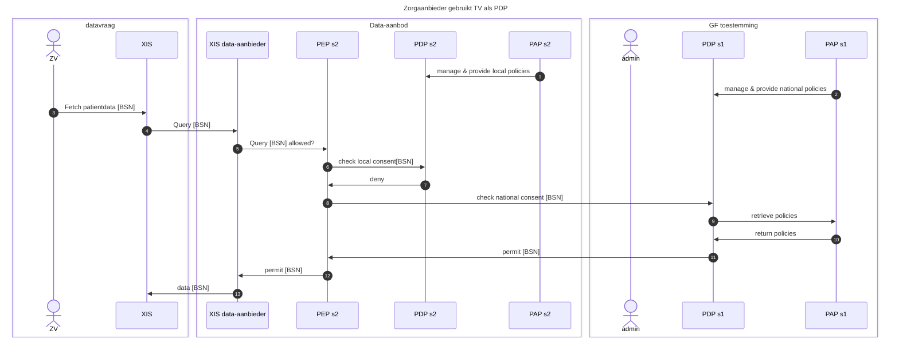

# Archimate 3.2 SVG (afdruk van de raw file hieronder)

# Archimate 3.2 XML (Archimate Export Format(raw))
## deze file kan ingelezen worden in tools (zoals open source Archi) die de archimate 3.2 modeleertaal ondersteunen
## raw file

# Sequentiediagrammen (MerMaid)
## Sequentiediagram 1: Zorgaanbieder gebruikt TV als PDP

## Sequentiediagram 2
